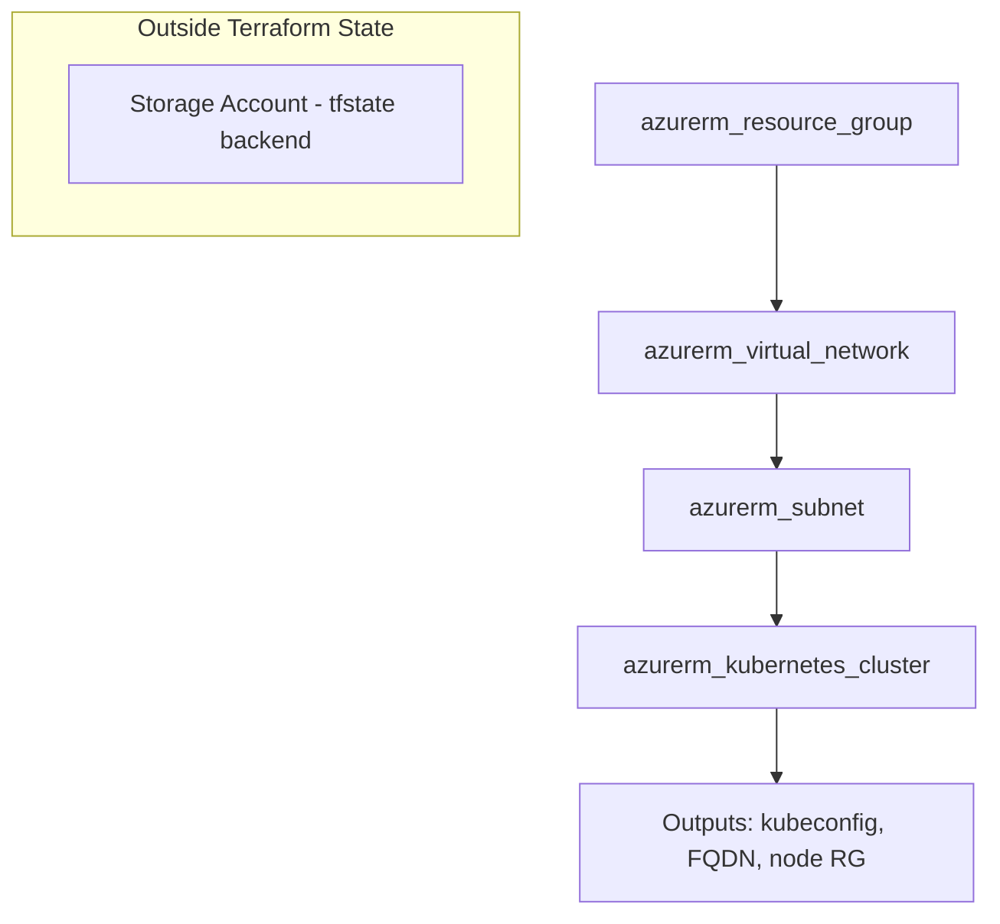
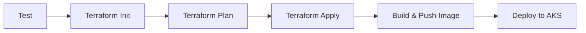

# Design Document: Azure Terraform IaC

## Overview

This design codifies the Azure infrastructure for the portfolio website as Terraform configuration. The Terraform module provisions a resource group, virtual network, subnet, and AKS cluster — the full stack needed to host the Flask portfolio application on Kubernetes. The design prioritizes Azure Free Tier compatibility (single Standard_B2s node, minimal disk), ephemeral spin-up/teardown workflows, and integration with the existing Azure DevOps CI/CD pipeline.

### Design Decisions

| Decision | Rationale |
|----------|-----------|
| Single flat module (no nested modules) | Small project; one environment; avoids over-engineering |
| `kubenet` network plugin | Lower IP consumption than Azure CNI; sufficient for single-node Free Tier cluster |
| System-assigned managed identity | No service principal rotation; simplest auth model for AKS |
| State backend in separate storage account | Survives `terraform destroy`; ~$0.02/month on Free Tier |
| Terraform stages inserted before Build in pipeline | Infrastructure must exist before Docker push and K8s deploy |
| Standard SKU load balancer | Required for nginx ingress external IP allocation |

## Architecture

### Resource Dependency Graph



### Directory Structure

```
terraform/
├── backend.tf              # Remote state backend configuration
├── main.tf                 # Resource definitions (RG, VNet, Subnet, AKS)
├── variables.tf            # Input variable declarations with types/defaults
├── outputs.tf              # Output values for pipeline consumption
├── providers.tf            # Provider version pins and feature blocks
├── terraform.tfvars.example # Example variable values (committed)
├── .terraform.lock.hcl     # Provider lock file (committed)
└── README.md               # Usage docs, bootstrap steps, architecture notes
```

### Pipeline Stage Flow



## Components and Interfaces

### 1. Provider Configuration (`providers.tf`)

```hcl
terraform {
  required_version = ">= 1.5.0"

  required_providers {
    azurerm = {
      source  = "hashicorp/azurerm"
      version = "~> 3.100"
    }
    azuread = {
      source  = "hashicorp/azuread"
      version = "~> 2.50"
    }
  }
}

provider "azurerm" {
  features {
    resource_group {
      prevent_deletion_if_contains_resources = false
    }
  }
}
```

**Rationale:** Pessimistic constraint (`~>`) pins to minor version, allowing only patch updates. The `prevent_deletion_if_contains_resources = false` setting enables clean `terraform destroy` without manual resource removal.

### 2. Backend Configuration (`backend.tf`)

```hcl
terraform {
  backend "azurerm" {
    resource_group_name  = "tfstate-rg"
    storage_account_name = "youraccountnamehere"
    container_name       = "tfstate"
    key                  = "portfolio.terraform.tfstate"
  }
}
```

State locking is automatic via Azure Blob lease mechanism — no additional configuration needed.

### 3. Resource Group (`main.tf`)

```hcl
resource "azurerm_resource_group" "portfolio" {
  name     = var.resource_group_name
  location = var.location

  tags = {
    environment = var.environment
    project     = var.project_name
  }
}
```

### 4. Virtual Network and Subnet (`main.tf`)

```hcl
resource "azurerm_virtual_network" "portfolio" {
  name                = "${var.resource_group_name}-vnet"
  location            = azurerm_resource_group.portfolio.location
  resource_group_name = azurerm_resource_group.portfolio.name
  address_space       = [var.vnet_address_space]
}

resource "azurerm_subnet" "aks" {
  name                 = "aks-subnet"
  resource_group_name  = azurerm_resource_group.portfolio.name
  virtual_network_name = azurerm_virtual_network.portfolio.name
  address_prefixes     = [var.subnet_address_prefix]
}
```

**Subnet sizing:** The default /24 provides 251 usable IPs. With kubenet, each node consumes 1 IP. A max node count of 10 plus ~30 system pod IPs is well within capacity.

### 5. AKS Cluster (`main.tf`)

```hcl
resource "azurerm_kubernetes_cluster" "portfolio" {
  name                = var.aks_cluster_name
  location            = azurerm_resource_group.portfolio.location
  resource_group_name = azurerm_resource_group.portfolio.name
  dns_prefix          = var.dns_prefix
  kubernetes_version  = var.kubernetes_version

  default_node_pool {
    name                = "system"
    node_count          = var.node_count
    vm_size             = var.node_vm_size
    os_disk_size_gb     = var.os_disk_size_gb
    vnet_subnet_id      = azurerm_subnet.aks.id
    type                = "VirtualMachineScaleSets"
  }

  identity {
    type = "SystemAssigned"
  }

  network_profile {
    network_plugin    = var.network_plugin
    load_balancer_sku = "standard"
  }

  dynamic "http_application_routing" {
    for_each = var.enable_http_app_routing ? [1] : []
    content {}
  }

  tags = {
    environment = var.environment
    project     = var.project_name
  }
}
```

### 6. CI/CD Pipeline Integration

New stages are inserted into `azure-pipelines.yml` between the existing `Test` stage and the `Build` stage:

```yaml
- stage: TerraformPlan
  displayName: 'Terraform Plan'
  dependsOn: Test
  jobs:
    - job: Plan
      pool:
        name: 'Default'
      steps:
        - task: Bash@3
          displayName: 'Terraform Init & Plan'
          inputs:
            targetType: inline
            script: |
              set -ex
              cd terraform
              terraform init -input=false
              terraform plan -input=false -out=tfplan
          env:
            ARM_CLIENT_ID: $(ARM_CLIENT_ID)
            ARM_CLIENT_SECRET: $(ARM_CLIENT_SECRET)
            ARM_SUBSCRIPTION_ID: $(ARM_SUBSCRIPTION_ID)
            ARM_TENANT_ID: $(ARM_TENANT_ID)
        - publish: terraform/tfplan
          artifact: tfplan

- stage: TerraformApply
  displayName: 'Terraform Apply'
  dependsOn: TerraformPlan
  condition: succeeded()
  jobs:
    - job: Apply
      pool:
        name: 'Default'
      steps:
        - download: current
          artifact: tfplan
        - task: Bash@3
          displayName: 'Terraform Apply'
          inputs:
            targetType: inline
            script: |
              set -ex
              cd terraform
              terraform init -input=false
              terraform apply -input=false $(Pipeline.Workspace)/tfplan
          env:
            ARM_CLIENT_ID: $(ARM_CLIENT_ID)
            ARM_CLIENT_SECRET: $(ARM_CLIENT_SECRET)
            ARM_SUBSCRIPTION_ID: $(ARM_SUBSCRIPTION_ID)
            ARM_TENANT_ID: $(ARM_TENANT_ID)
```

The existing `Build` stage changes its `dependsOn` from `Test` to `TerraformApply`. Pipeline variables `ARM_CLIENT_ID`, `ARM_CLIENT_SECRET`, `ARM_SUBSCRIPTION_ID`, and `ARM_TENANT_ID` are stored as secret pipeline variables in Azure DevOps for service principal authentication.

### 7. Ingress Controller Support

The Terraform module does **not** install Helm charts directly (avoids Terraform Helm provider complexity for a single-node demo cluster). Instead it:

1. Configures AKS with Standard SKU load balancer (enables external IP allocation)
2. Outputs a ready-to-run script block with Helm commands for nginx ingress + cert-manager installation
3. Exposes `var.enable_http_app_routing` as an alternative for simpler demos

## Data Models

### Input Variables (`variables.tf`)

| Variable | Type | Default | Description |
|----------|------|---------|-------------|
| `location` | `string` | `"eastus"` | Azure region for all resources |
| `resource_group_name` | `string` | `"portfolio-rg"` | Name of the resource group |
| `aks_cluster_name` | `string` | `"portfolio-aks"` | Name of the AKS cluster |
| `dns_prefix` | `string` | `"portfolio"` | DNS prefix for AKS FQDN |
| `node_vm_size` | `string` | `"Standard_B2s"` | VM size for node pool (Free Tier eligible) |
| `node_count` | `number` | `1` | Number of nodes in default pool |
| `os_disk_size_gb` | `number` | `30` | OS disk size per node in GB |
| `vnet_address_space` | `string` | `"10.0.0.0/16"` | VNet CIDR block |
| `subnet_address_prefix` | `string` | `"10.0.1.0/24"` | AKS subnet CIDR |
| `kubernetes_version` | `string` | `"1.29"` | Kubernetes minor version |
| `network_plugin` | `string` | `"kubenet"` | AKS network plugin |
| `environment` | `string` | `"dev"` | Environment tag value |
| `project_name` | `string` | `"portfolio"` | Project tag value |
| `enable_http_app_routing` | `bool` | `false` | Enable AKS HTTP app routing add-on |
| `state_container_name` | `string` | `"tfstate"` | Blob container for state file |

### Validation Rules

```hcl
variable "node_count" {
  type        = number
  default     = 1
  description = "Number of nodes in the AKS default node pool (1-10)"
  validation {
    condition     = var.node_count >= 1 && var.node_count <= 10
    error_message = "Node count must be between 1 and 10."
  }
}

variable "os_disk_size_gb" {
  type        = number
  default     = 30
  description = "OS disk size in GB for each node (30-1024)"
  validation {
    condition     = var.os_disk_size_gb >= 30 && var.os_disk_size_gb <= 1024
    error_message = "OS disk size must be between 30 and 1024 GB."
  }
}
```

### Output Values (`outputs.tf`)

| Output | Sensitive | Description |
|--------|-----------|-------------|
| `resource_group_name` | No | Name of the created resource group |
| `aks_cluster_name` | No | Name of the AKS cluster |
| `aks_cluster_fqdn` | No | FQDN of the AKS cluster API server |
| `aks_node_resource_group` | No | Auto-generated node resource group name |
| `kube_config_raw` | Yes | Full kubeconfig for cluster access |
| `get_credentials_command` | No | Ready-to-use `az aks get-credentials` command |
| `ingress_helm_commands` | No | Helm install commands for nginx + cert-manager |
| `load_balancer_ip_command` | No | Command to retrieve LB public IP after ingress install |

## Correctness Properties

*Traditional property-based testing does not apply to this feature.* This is Infrastructure-as-Code (Terraform/HCL configuration) — there are no pure functions with input/output behavior amenable to universal property verification. Instead, infrastructure correctness is validated through Terraform's built-in mechanisms and operational invariants.

The following infrastructure invariants are verified through `terraform plan`, `terraform validate`, and operational testing rather than property-based test libraries:

### Property 1: Idempotency

*For any* valid Terraform configuration that has been successfully applied, running `terraform plan` immediately after must report zero changes — applying the same configuration twice produces no modifications on the second run.

**Validates: Requirements 1.1, 2.1**

**Verified by:** Running `terraform plan` after `terraform apply` and asserting exit code 0 with empty changeset.

### Property 2: Dependency Ordering

*For any* set of resources in the module, Terraform's DAG execution engine creates and destroys them in the correct dependency order (Resource Group → VNet → Subnet → AKS). No resource is created before its dependencies exist, and no resource is destroyed while dependents still reference it.

**Validates: Requirements 2.2, 3.1**

**Verified by:** `terraform validate` (catches circular dependencies) and successful `terraform apply` (proves ordering is viable).

### Property 3: State Consistency

*For any* successful `terraform apply`, the state file accurately reflects the deployed resources in Azure. A subsequent `terraform plan` detects no drift between recorded state and actual infrastructure.

**Validates: Requirements 2.3, 4.1**

**Verified by:** Running `terraform plan` post-apply (detects drift between state and reality) and `terraform refresh` to reconcile.

### Property 4: Variable Validation

*For any* input variable value outside its declared validation range (e.g., `node_count` outside 1–10, `os_disk_size_gb` outside 30–1024), `terraform plan` must reject the value at plan time with the declared error message, before any API call is made.

**Validates: Requirements 3.2**

**Verified by:** `terraform plan` with invalid variable values exits non-zero with the declared error message.

### Property 5: Clean Teardown

*For any* fully-applied infrastructure state, `terraform destroy` removes all managed resources and leaves no orphaned infrastructure (excluding the state backend storage account which is intentionally outside the module's lifecycle).

**Validates: Requirements 5.1**

**Verified by:** Running `terraform destroy` followed by verifying the resource group no longer exists in Azure.

## Error Handling

### Terraform-Level Errors

| Scenario | Behavior |
|----------|----------|
| Invalid variable value | `terraform plan` rejects with validation error message naming the variable |
| Insufficient Azure permissions | `terraform apply` exits non-zero; Azure error message surfaces in output |
| Quota/capacity exceeded | AKS creation fails; Azure error message preserved in Terraform output |
| State backend unreachable | `terraform init`/`plan`/`apply` fails immediately; no state modification |
| Resource locked during destroy | `terraform destroy` reports blocking resource; state remains consistent |

### Pipeline-Level Errors

| Scenario | Behavior |
|----------|----------|
| `terraform plan` fails | Pipeline halts; Build and Deploy stages do not execute |
| `terraform apply` fails | Pipeline halts; no K8s deployment attempted |
| Service principal credentials missing | Init fails with auth error; pipeline marked failed |

### Idempotency

Terraform is inherently idempotent. Running `terraform apply` when infrastructure matches state produces no changes. The pipeline leverages this — if no infrastructure drift exists, the apply stage is effectively a no-op and the pipeline proceeds to Build.

## Testing Strategy

### Why Property-Based Testing Does Not Apply

This feature is Infrastructure-as-Code (Terraform/HCL configuration). There are no pure functions with input/output behavior to test with PBT. The "inputs" are variable values and the "outputs" are Azure API calls — not transformations amenable to universal property verification.

### Recommended Testing Approach

| Layer | Tool | What It Validates |
|-------|------|-------------------|
| **Static validation** | `terraform validate` | HCL syntax, type constraints, required attributes |
| **Plan inspection** | `terraform plan` (in pipeline) | Resource graph correctness, no unexpected changes |
| **Format check** | `terraform fmt -check` | Consistent code style |
| **Integration test** | Manual `terraform apply` + `kubectl get nodes` | End-to-end provisioning works |
| **Teardown test** | `terraform destroy` | Clean removal of all resources |

### Pipeline Test Integration

The `terraform plan` stage in CI/CD acts as the primary automated validation gate. It catches:
- Missing or invalid variables
- Provider version incompatibilities
- Resource dependency cycles
- State drift from manual changes

### Bootstrap Verification

A one-time manual check after bootstrap:
1. Storage account exists and is accessible
2. `terraform init` succeeds against the backend
3. State file is created in the blob container

## Teardown Workflow

### Procedure

```bash
# 1. Drain workloads (optional — prevents pod disruption alerts)
kubectl -n portfolio scale deployment/portfolio --replicas=0

# 2. Remove PVCs (releases Azure Disks before RG deletion)
kubectl -n portfolio delete pvc portfolio-db-pvc

# 3. Remove ingress controller (releases public IP)
helm uninstall ingress-nginx -n ingress-nginx
helm uninstall cert-manager -n cert-manager

# 4. Destroy all Terraform-managed resources
cd terraform
terraform destroy -auto-approve
```

### What Persists After Teardown

- **State backend storage account** (`tfstate-rg` resource group) — ~$0.02/month
- **Azure DevOps pipeline configuration** — no cost
- **Docker Hub images** — no cost on free tier

### What Is Lost

- **SQLite database on PVC** — data is destroyed with the Azure Disk
- **Let's Encrypt certificates** — re-issued on next spin-up
- **AKS cluster and all workloads** — fully recreated by `terraform apply`

## Bootstrap Procedure (State Backend)

This is a one-time setup before first `terraform init`:

```bash
# Create resource group for state (separate from portfolio resources)
az group create --name tfstate-rg --location eastus

# Create storage account (name must be globally unique)
az storage account create \
  --name <unique-storage-name> \
  --resource-group tfstate-rg \
  --sku Standard_LRS \
  --encryption-services blob \
  --min-tls-version TLS1_2

# Create blob container
az storage container create \
  --name tfstate \
  --account-name <unique-storage-name>
```

After bootstrap, update `backend.tf` with the actual storage account name and run `terraform init`.
