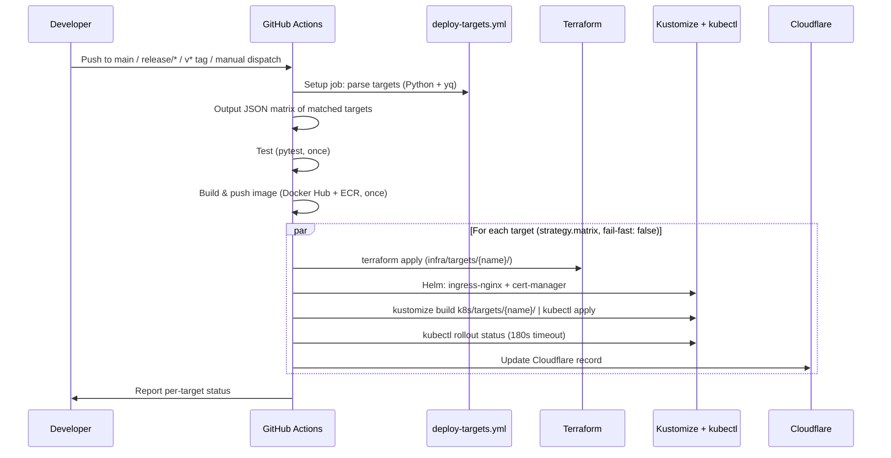

# Design Document: Multi-Cloud Deployment

## Overview

This design restructures the portfolio project from a single-target Azure deployment into a scalable, configuration-driven multi-cloud architecture supporting Azure AKS and AWS EKS as equal deployment peers. The architecture uses a layered hierarchy for both infrastructure code (Terraform modules → target instances) and Kubernetes manifests (base → provider → target) to eliminate duplication while supporting the full provider × region matrix.

The key design principle is **configuration over code**: adding a new deployment target requires only a config entry in `deploy-targets.yml` and running the generator script — no changes to workflow logic or existing target configurations.

### Current Implementation

- **Terraform**: `infra/modules/{provider}/` + `infra/targets/{name}/` with independent state per target
- **Kubernetes**: Kustomize layering (`k8s/base/` → `k8s/providers/{provider}/` → `k8s/targets/{name}/`)
- **CI/CD**: GitHub Actions unified workflow (`.github/workflows/deploy.yml`) with dynamic matrix strategy
- **Registry**: Docker Hub + ECR (both pushed on every build)
- **DNS**: `orchidflow.io` → Azure, `aws.orchidflow.io` → AWS (per-target DNS management via Cloudflare)
- **Generator**: `scripts/generate-targets.py` generates Terraform and K8s target files from config

### Key Design Decisions

1. **GitHub Actions as single CI/CD platform** — unified workflow handles both Azure and AWS targets
2. **Dynamic matrix strategy** — `setup` job parses config, outputs JSON matrix for parallel fan-out
3. **Derived values** — cluster_name, resource_group, registry computed from target name (not stored in config)
4. **Recreate deployment strategy** — required by ReadWriteOnce PVC (EBS/Azure Disk)
5. **Target generator script** — developer tool that generates boilerplate files from config
6. **EBS CSI driver** — installed as EKS add-on via Terraform (required for EBS PVC provisioning)
7. **S3 state locking via use_lockfile** — no DynamoDB table needed

## Architecture

```mermaid
graph TB
    subgraph "Configuration Layer"
        DTC[deploy-targets.yml]
        GEN[scripts/generate-targets.py]
    end

    subgraph "Pipeline Layer - GitHub Actions"
        DP[.github/workflows/deploy.yml]
        TP[.github/workflows/teardown.yml]
    end

    subgraph "Infrastructure Layer"
        subgraph "Modules"
            AM[infra/modules/aws/]
            AZM[infra/modules/azure/]
        end
        subgraph "Targets - Generated"
            T1[infra/targets/prod-azure-eastus/]
            T2[infra/targets/prod-aws-us-east-1/]
            T3[infra/targets/dev-aws-us-east-1/]
        end
    end

    subgraph "Kubernetes Layer - Kustomize"
        KB[k8s/base/]
        KP_AWS[k8s/providers/aws/]
        KP_AZ[k8s/providers/azure/]
        KT[k8s/targets/{name}/ - Generated]
    end

    subgraph "External Services"
        DH[Docker Hub]
        ECR[AWS ECR]
        CF[Cloudflare DNS]
        LE[Let's Encrypt]
    end

    DTC --> GEN
    GEN --> T1 & T2 & T3
    GEN --> KT
    DTC --> DP
    DP --> T1 & T2 & T3
    DP --> DH & ECR & CF
    T1 --> AZM
    T2 & T3 --> AM
    KB --> KP_AWS & KP_AZ
    KP_AWS & KP_AZ --> KT
```

### Deployment Flow



## Components and Interfaces

### 1. deploy-targets.yml (Configuration Hub)

The central configuration file. The workflow reads this at runtime to build the deployment matrix. The generator script reads it to produce Terraform and K8s files.

**Derived values (not in config):**
- `cluster_name` → `portfolio-{target-name}`
- `resource_group` → `portfolio-rg-{target-name}` (Azure only)
- `registry` → `ecr` (AWS) or `dockerhub` (Azure)
- VPC CIDRs → auto-assigned per AWS target

```yaml
targets:
  - name: prod-azure-eastus
    enabled: true
    provider: azure
    region: eastus
    github_environment: production
    dns_subdomain: ""
    replicas: 2
    resources:
      cpu_request: 100m
      cpu_limit: 500m
      memory_request: 64Mi
      memory_limit: 256Mi
    trigger:
      branches: [release/*]
      tags: [v*]

  - name: prod-aws-us-east-1
    enabled: true
    provider: aws
    region: us-east-1
    github_environment: production
    dns_subdomain: aws
    replicas: 2
    resources:
      cpu_request: 100m
      cpu_limit: 500m
      memory_request: 64Mi
      memory_limit: 256Mi
    trigger:
      branches: [release/*]
      tags: [v*]
```

**Schema fields:**
| Field | Type | Description |
|-------|------|-------------|
| `name` | string | Target identifier: `{env}-{provider}-{region}` |
| `enabled` | boolean | Whether target deploys on automatic triggers |
| `provider` | string | `aws` or `azure` — selects module + K8s overlay |
| `region` | string | Cloud region |
| `github_environment` | string | GitHub Actions environment for protection rules |
| `dns_subdomain` | string | Subdomain prefix (empty = root domain) |
| `replicas` | number | Pod replica count |
| `resources` | object | cpu_request, cpu_limit, memory_request, memory_limit |
| `trigger` | object | branches and tags that trigger deployment |

### 2. Target Generator Script (`scripts/generate-targets.py`)

Developer tool (not run in CI) that reads `deploy-targets.yml` and generates:
- `infra/targets/{name}/main.tf`, `backend.tf`, `versions.tf`
- `k8s/targets/{name}/kustomization.yaml`, `ingress-host-patch.yaml`

Validates config (warns if production environment triggers on main).

### 3. Infrastructure as Code (Terraform)

#### AWS Module (`infra/modules/aws/`)

| File | Contents |
|------|----------|
| `main.tf` | VPC, subnets (2 public + 2 private), IGW, NAT, routes |
| `eks.tf` | EKS cluster, node group (t3.medium), OIDC provider, EBS CSI driver add-on |
| `ecr.tf` | ECR repo (conditional), lifecycle policy, IAM pull policy |
| `variables.tf` | region, cluster_name, environment, project_name, vpc_cidr, instance_type, k8s_version, create_ecr, cluster_admin_arns |
| `outputs.tf` | cluster_endpoint, cluster_name, ecr_repository_url |
| `versions.tf` | aws ~> 5.0, default_tags (Target, Project, ManagedBy) |

#### Azure Module (`infra/modules/azure/`)

| File | Contents |
|------|----------|
| `main.tf` | Resource group, AKS cluster (Standard_D2s_v3) |
| `variables.tf` | location, resource_group_name, aks_cluster_name, target_name, project_name, kubernetes_version |
| `outputs.tf` | cluster_endpoint, cluster_ca_data, cluster_name, resource_group_name |
| `versions.tf` | azurerm ~> 3.0, azuread ~> 2.0 |

#### Backend Strategy

- AWS: S3 with `use_lockfile = true` (no DynamoDB table)
- Azure: Azure Blob Storage (azurerm backend)
- Each target has independent state — no cross-references

#### Tagging

All resources tagged with:
```
Target    = {target-name}
Project   = portfolio
ManagedBy = terraform
```

### 4. Kubernetes Manifest Layering (Kustomize)

#### Base (`k8s/base/`)
- namespace, deployment (Recreate strategy), service, PVC, cert-manager-issuer, ingress

#### Provider (`k8s/providers/{provider}/`)
- StorageClass (EBS gp3 / Azure managed-premium)
- PVC patch (storageClassName)
- Ingress patch (provider-specific annotations)

#### Target (`k8s/targets/{name}/`) — Generated
- References `../../providers/{provider}`
- Inline patches for replicas + resources (from deploy-targets.yml)
- Ingress host patch (from dns_subdomain)
- Image override (ECR URL for AWS, Docker Hub for Azure)

### 5. Pipeline Architecture (GitHub Actions)

#### Jobs

| Job | Purpose | Timeout |
|-----|---------|---------|
| `setup` | Parse deploy-targets.yml → output JSON matrix | 5 min |
| `test` | pytest with coverage | 10 min |
| `build` | Docker build → push to Docker Hub + ECR | 15 min |
| `deploy` | Fan-out per target (strategy.matrix) | 30 min |

#### Deploy Job Steps (per target)

1. Provider credentials (aws-actions/configure-aws-credentials or azure/login)
2. Terraform init + apply
3. kubectl config (aws eks update-kubeconfig or az aks get-credentials)
4. Helm: ingress-nginx (admissionWebhooks disabled)
5. Wait for Load Balancer (300s)
6. Helm: cert-manager (300s timeout)
7. Create secrets (pull secrets + app secret)
8. Kustomize deploy (edit set image + build + apply)
9. Verify rollout (180s)
10. Update Cloudflare DNS

### 6. GitHub Secrets

| Secret | Used for |
|--------|----------|
| `AWS_ACCESS_KEY_ID` | AWS IAM |
| `AWS_SECRET_ACCESS_KEY` | AWS IAM |
| `AWS_ACCOUNT_ID` | ECR URL |
| `AZURE_CLIENT_ID` | Azure SP (mapped to ARM_CLIENT_ID for Terraform) |
| `AZURE_CLIENT_SECRET` | Azure SP |
| `AZURE_SUBSCRIPTION_ID` | Azure subscription |
| `AZURE_TENANT_ID` | Azure AD tenant |
| `DOCKERHUB_USERNAME` | Docker Hub |
| `DOCKERHUB_TOKEN` | Docker Hub |
| `CLOUDFLARE_API_TOKEN` | DNS |
| `CLOUDFLARE_ZONE_ID` | DNS zone |

### 7. File Organization

```
mysite/
├── deploy-targets.yml                      # Configuration hub (runtime + generator input)
├── scripts/
│   └── generate-targets.py                # Developer tool: generate target files
├── .github/workflows/
│   ├── deploy.yml                         # Unified deploy (dynamic matrix)
│   └── teardown.yml                       # Unified teardown (manual dispatch)
├── infra/
│   ├── modules/
│   │   ├── aws/                           # VPC, EKS, ECR, EBS CSI
│   │   └── azure/                         # RG, AKS
│   └── targets/                           # Generated by scripts/generate-targets.py
│       ├── prod-azure-eastus/
│       ├── prod-aws-us-east-1/
│       └── dev-aws-us-east-1/
├── k8s/
│   ├── base/                              # Shared manifests (Recreate strategy)
│   ├── providers/
│   │   ├── aws/                           # EBS StorageClass, NLB annotations
│   │   └── azure/                         # Azure Disk StorageClass, LB annotations
│   ├── environments/                      # Shared environment patches (optional)
│   │   ├── dev/
│   │   ├── qa/
│   │   └── prod/
│   └── targets/                           # Generated by scripts/generate-targets.py
│       ├── prod-azure-eastus/
│       ├── prod-aws-us-east-1/
│       └── dev-aws-us-east-1/
├── portfolio/                             # Flask app (unchanged)
├── tests/                                 # Test suite
└── docs/
    ├── deployment-calling-stack.md
    ├── adding-deployment-targets.md
    └── journey-and-architecture.md
```

## Adding a New Target

1. Edit `deploy-targets.yml` — add target entry
2. Run `python scripts/generate-targets.py`
3. Review generated files
4. Commit and push

## Error Handling

| Error | Behavior |
|-------|----------|
| Target not in config | Not matched → no deployment runs |
| Missing credentials | Provider steps fail; other targets continue |
| Terraform failure | That target's job fails; others continue |
| LB/cert-manager timeout | That target's job fails; others continue |
| Rollout timeout (180s) | That target's job fails; others continue |
| Teardown of non-existent infra | Succeeds (idempotent) |
| Teardown confirm ≠ "destroy" | Workflow skipped |

Isolation: `fail-fast: false` ensures one target's failure never blocks another.
