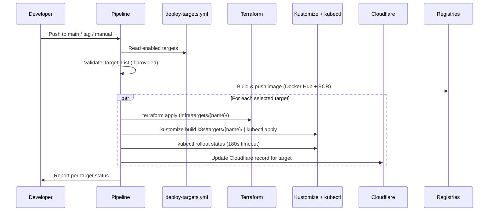

# Design Document: Multi-Cloud Deployment

## Overview

This design restructures the portfolio project from a single-target Azure deployment into a scalable, configuration-driven multi-cloud architecture supporting Azure AKS and AWS EKS as equal deployment peers. The architecture uses a 4-layer hierarchy for both infrastructure code (Terraform modules → target instances) and Kubernetes manifests (base → provider → environment → target) to eliminate duplication while supporting the full environment × provider × region matrix.

The key design principle is **configuration over code**: adding a new deployment target (region, environment, or provider) requires minimal new files and a single config entry in `deploy-targets.yml`, with no changes to pipeline logic or existing target configurations.

### Current State

- **Terraform**: Flat `terraform/` directory with Azure-only resources (VNet, AKS), azurerm backend
- **Kubernetes**: Flat `k8s/` directory with single-target manifests and `__IMAGE_TAG__` sed replacement
- **Pipeline**: `azure-pipelines.yml` with sequential stages (Test → Plan → Apply → InfraSetup → Build → Deploy)
- **Registry**: Docker Hub only (`ltyang/portfolio`)
- **DNS**: Cloudflare managing `orchidflow.io` and `www.orchidflow.io` pointing to Azure

### Target State

- **Terraform**: `infra/modules/{provider}/` + `infra/targets/{env}-{provider}-{region}/` with independent state
- **Kubernetes**: 4-layer Kustomize composition (`k8s/base/` → `providers/` → `environments/` → `targets/`)
- **Pipeline**: `pipelines/deploy.yml` reading `deploy-targets.yml`, parallel fan-out per target
- **Registry**: Docker Hub + ECR (AWS targets pull from ECR)
- **DNS**: `orchidflow.io` → Azure, `aws.orchidflow.io` → AWS (per-target DNS management)

## Architecture

```mermaid
graph TB
    subgraph "Configuration Layer"
        DTC[deploy-targets.yml]
    end

    subgraph "Pipeline Layer"
        DP[pipelines/deploy.yml]
        TP[pipelines/teardown.yml]
    end

    subgraph "Infrastructure Layer"
        subgraph "Modules"
            AM[infra/modules/aws/]
            AZM[infra/modules/azure/]
        end
        subgraph "Targets"
            T1[infra/targets/prod-azure-australiaeast/]
            T2[infra/targets/prod-aws-us-east-1/]
            T3[infra/targets/dev-aws-us-east-1/]
        end
    end

    subgraph "Kubernetes Layer (Kustomize)"
        KB[k8s/base/]
        KP_AWS[k8s/providers/aws/]
        KP_AZ[k8s/providers/azure/]
        KE_DEV[k8s/environments/dev/]
        KE_PROD[k8s/environments/prod/]
        KT[k8s/targets/{target-name}/]
    end

    subgraph "External Services"
        DH[Docker Hub]
        ECR[AWS ECR]
        CF[Cloudflare DNS]
        LE[Let's Encrypt]
    end

    DTC --> DP
    DTC --> TP
    DP --> T1
    DP --> T2
    DP --> T3
    T1 --> AZM
    T2 --> AM
    T3 --> AM
    DP --> DH
    DP --> ECR
    DP --> CF
    KB --> KP_AWS
    KB --> KP_AZ
    KP_AWS --> KE_DEV
    KP_AWS --> KE_PROD
    KP_AZ --> KE_PROD
    KE_DEV --> KT
    KE_PROD --> KT
```

### Deployment Flow



## Components and Interfaces

### 1. deploy-targets.yml (Configuration Hub)

The central configuration file at the project root. The pipeline reads this file to determine which targets to deploy, which provider module and K8s overlays to use, and which trigger rules apply.

```yaml
# deploy-targets.yml
targets:
  - name: prod-azure-australiaeast
    enabled: true
    provider: azure
    region: australiaeast
    environment: prod
    trigger:
      branches: [release/*]
      tags: [v*]
    dns:
      subdomain: ""          # root domain (orchidflow.io)
      record_type: A
    registry: dockerhub
    cluster_name: portfolio-aks
    resource_group: portfolio-rg

  - name: prod-aws-us-east-1
    enabled: true
    provider: aws
    region: us-east-1
    environment: prod
    trigger:
      branches: [release/*]
      tags: [v*]
    dns:
      subdomain: aws         # aws.orchidflow.io
      record_type: A         # or CNAME for NLB hostname
    registry: ecr
    cluster_name: portfolio-eks
    ecr_repo: portfolio

  - name: dev-aws-us-east-1
    enabled: false
    provider: aws
    region: us-east-1
    environment: dev
    trigger:
      branches: [main]
    dns:
      subdomain: dev-aws
      record_type: A
    registry: ecr
    cluster_name: portfolio-eks-dev
    ecr_repo: portfolio
```

**Schema fields:**
| Field | Type | Description |
|-------|------|-------------|
| `name` | string | Target identifier, format: `{env}-{provider}-{region}` |
| `enabled` | boolean | Whether target is deployed on automatic triggers |
| `provider` | string | Cloud provider (`aws` \| `azure`) — selects module + K8s overlay |
| `region` | string | Cloud region for the target |
| `environment` | string | Deployment stage (`dev` \| `qa` \| `prod`) — selects K8s env overlay |
| `trigger` | object | Source control events that initiate deployment |
| `dns` | object | Cloudflare DNS configuration for this target |
| `registry` | string | Container registry to pull from (`dockerhub` \| `ecr`) |
| `cluster_name` | string | Kubernetes cluster name (for credential retrieval) |
| `resource_group` | string | Azure resource group (Azure targets only) |
| `ecr_repo` | string | ECR repository name (AWS targets only) |

### 2. Infrastructure as Code (Terraform)

#### Module Structure

**`infra/modules/aws/`** — Reusable AWS provider module:
- `main.tf` — VPC (configurable CIDR, default 10.1.0.0/16), 2 public + 2 private subnets across 2 AZs, Internet Gateway, NAT Gateway, route tables
- `eks.tf` — EKS cluster + managed node group (desired: 1, min: 1, max: 2, instance type: t3.small, K8s version configurable)
- `ecr.tf` — ECR repository with lifecycle policy (max 10 tagged, untagged expire after 1 day), image scanning, IAM pull policy for EKS nodes
- `variables.tf` — Input variables (region, cluster_name, environment, project_name, vpc_cidr, instance_type, k8s_version, etc.)
- `outputs.tf` — cluster_endpoint, cluster_ca_data, cluster_name, ecr_repository_url
- `versions.tf` — Required providers (aws ~> 5.0)

**`infra/modules/azure/`** — Reusable Azure provider module (refactored from current `terraform/`):
- `main.tf` — Resource group, VNet, subnet, AKS cluster (mirrors current config)
- `variables.tf` — Input variables (location, resource_group_name, aks_cluster_name, etc.)
- `outputs.tf` — cluster_endpoint, cluster_ca_data, cluster_name, resource_group_name
- `versions.tf` — Required providers (azurerm ~> 3.0, azuread ~> 2.0)

#### Target Instance Structure

Each target is a thin root module that calls its provider module:

```hcl
# infra/targets/prod-aws-us-east-1/main.tf
module "aws" {
  source = "../../modules/aws"

  region          = "us-east-1"
  cluster_name    = "portfolio-eks"
  environment     = "prod"
  project_name    = "portfolio"
  vpc_cidr        = "10.1.0.0/16"
  instance_type   = "t3.small"
  k8s_version     = "1.31"
}

output "cluster_endpoint" { value = module.aws.cluster_endpoint }
output "cluster_ca_data"  { value = module.aws.cluster_ca_data }
output "cluster_name"     { value = module.aws.cluster_name }
output "ecr_repo_url"     { value = module.aws.ecr_repository_url }
```

```hcl
# infra/targets/prod-aws-us-east-1/backend.tf
terraform {
  backend "s3" {
    bucket         = "portfolio-tfstate"
    key            = "prod-aws-us-east-1/terraform.tfstate"
    region         = "us-east-1"
    dynamodb_table = "portfolio-tfstate-lock"
    encrypt        = true
  }
}
```

```hcl
# infra/targets/prod-azure-australiaeast/main.tf
module "azure" {
  source = "../../modules/azure"

  location            = "australiaeast"
  resource_group_name = "portfolio-rg"
  aks_cluster_name    = "portfolio-aks"
  environment         = "prod"
  project_name        = "portfolio"
  kubernetes_version  = "1.34"
}

output "cluster_endpoint" { value = module.azure.cluster_endpoint }
output "cluster_ca_data"  { value = module.azure.cluster_ca_data }
output "cluster_name"     { value = module.azure.cluster_name }
```

```hcl
# infra/targets/prod-azure-australiaeast/backend.tf
terraform {
  backend "azurerm" {
    resource_group_name  = "tfstate-rg"
    storage_account_name = "ylt202605201452"
    container_name       = "tfstate"
    key                  = "prod-azure-australiaeast.terraform.tfstate"
  }
}
```

**Design Decision:** Each target maintains its own independent state backend. AWS targets use S3+DynamoDB, Azure targets use Azure Blob Storage. This ensures targets can be provisioned/destroyed independently without state conflicts.

### 3. Kubernetes Manifest Layering (Kustomize)

The 4-layer Kustomize composition eliminates manifest duplication while allowing provider-specific, environment-specific, and target-specific customization.

```mermaid
graph LR
    B[k8s/base/] -->|provider patches| P[k8s/providers/{provider}/]
    P -->|environment patches| E[k8s/environments/{env}/]
    E -->|target overrides| T[k8s/targets/{target-name}/]
```

#### Layer 1: Base (`k8s/base/`)

Cloud-agnostic shared manifests:

```yaml
# k8s/base/kustomization.yaml
apiVersion: kustomize.config.k8s.io/v1beta1
kind: Kustomization
resources:
  - namespace.yaml
  - deployment.yaml
  - service.yaml
  - pvc.yaml
  - cert-manager-issuer.yaml
```

The base deployment uses a placeholder image tag and contains all shared configuration (ports, env vars, probes, volume mounts). Key fields in base `deployment.yaml`:
- `revisionHistoryLimit: 5`
- Rolling update strategy: `maxUnavailable: 0`, `maxSurge: 1`
- `terminationGracePeriodSeconds: 60`
- `preStop` lifecycle hook: `sleep 5`
- Liveness probe: HTTP GET `/` port 5000, initialDelay 10s, period 30s
- Readiness probe: HTTP GET `/` port 5000, initialDelay 5s, period 10s
- Resource requests: 64Mi memory, 100m CPU
- Resource limits: 256Mi memory, 500m CPU

#### Layer 2: Provider (`k8s/providers/{provider}/`)

Cloud-specific patches shared across all targets of that provider:

```yaml
# k8s/providers/aws/kustomization.yaml
apiVersion: kustomize.config.k8s.io/v1beta1
kind: Kustomization
resources:
  - ../../base
  - storageclass.yaml
patches:
  - path: pvc-patch.yaml
  - path: ingress-patch.yaml
```

**AWS provider patches:**
- `storageclass.yaml` — EBS gp3 StorageClass
- `pvc-patch.yaml` — Sets `storageClassName: ebs-gp3`
- `ingress-patch.yaml` — NLB annotations (`service.beta.kubernetes.io/aws-load-balancer-type: nlb`)
- `imagepullsecret-patch.yaml` — ECR pull secret reference

**Azure provider patches:**
- `storageclass.yaml` — Azure managed-premium StorageClass (or default)
- `pvc-patch.yaml` — Sets `storageClassName: managed-premium`
- `ingress-patch.yaml` — Azure LB health probe annotation

```yaml
# k8s/providers/azure/kustomization.yaml
apiVersion: kustomize.config.k8s.io/v1beta1
kind: Kustomization
resources:
  - ../../base
  - storageclass.yaml
patches:
  - path: pvc-patch.yaml
  - path: ingress-patch.yaml
```

#### Layer 3: Environment (`k8s/environments/{env}/`)

Sizing and operational configuration shared across all targets of that environment:

```yaml
# k8s/environments/prod/kustomization.yaml
apiVersion: kustomize.config.k8s.io/v1beta1
kind: Kustomization
# Note: resources reference is set dynamically by the pipeline
# based on the provider for this target
patches:
  - path: replica-patch.yaml
  - path: resources-patch.yaml
```

```yaml
# k8s/environments/prod/replica-patch.yaml
apiVersion: apps/v1
kind: Deployment
metadata:
  name: portfolio
  namespace: portfolio
spec:
  replicas: 2
```

```yaml
# k8s/environments/dev/replica-patch.yaml
apiVersion: apps/v1
kind: Deployment
metadata:
  name: portfolio
  namespace: portfolio
spec:
  replicas: 1
```

**Environment patches:**
- `prod/` — `replicas: 2`, production resource limits, standard logging
- `dev/` — `replicas: 1`, relaxed resource limits, debug logging
- `qa/` — `replicas: 2`, production-like config, limited access

#### Layer 4: Target (`k8s/targets/{target-name}/`)

Target-specific overrides (usually minimal). Each target's `kustomization.yaml` composes the full chain:

```yaml
# k8s/targets/prod-aws-us-east-1/kustomization.yaml
apiVersion: kustomize.config.k8s.io/v1beta1
kind: Kustomization
resources:
  - ../../environments/prod
# The environments/prod kustomization references providers/aws
# Target-specific overrides (if any):
patches:
  - path: ingress-host-patch.yaml  # Sets aws.orchidflow.io
images:
  - name: ltyang/portfolio
    newName: 123456789.dkr.ecr.us-east-1.amazonaws.com/portfolio
    newTag: latest  # Overridden by pipeline at deploy time
```

**Design Decision:** The target layer's `kustomization.yaml` is the entry point for `kustomize build`. The pipeline runs `kustomize build k8s/targets/{target-name}/` to produce the final manifests. The image tag is set via `kustomize edit set image` at deploy time.

**Kustomize Composition Chain:**

To avoid circular references, the composition chain is structured as follows:
- `k8s/targets/{name}/kustomization.yaml` → references `../../environments/{env}/`
- `k8s/environments/{env}/kustomization.yaml` → references a provider (determined per-target)
- `k8s/providers/{provider}/kustomization.yaml` → references `../../base/`

Since an environment overlay must reference a specific provider, and different targets in the same environment may use different providers, the actual composition uses a **generated kustomization** approach: the pipeline generates the target's `kustomization.yaml` at deploy time (or uses a template with the correct provider path). Alternatively, each target's kustomization directly references both its provider and environment overlays using Kustomize's `components` or explicit resource/patch paths.

**Chosen approach:** Each target `kustomization.yaml` is a static file that explicitly references its provider overlay as the base resource, then applies environment patches on top:

```yaml
# k8s/targets/prod-aws-us-east-1/kustomization.yaml
apiVersion: kustomize.config.k8s.io/v1beta1
kind: Kustomization
resources:
  - ../../providers/aws    # Layer 2: provider (which includes base)
patches:
  - path: ../../environments/prod/replica-patch.yaml    # Layer 3: env
  - path: ../../environments/prod/resources-patch.yaml
  - path: ingress-host-patch.yaml                       # Layer 4: target
images:
  - name: ltyang/portfolio
    newName: 123456789.dkr.ecr.us-east-1.amazonaws.com/portfolio
    newTag: BUILD_ID
```

This keeps all kustomization files static and avoids runtime generation.

### 4. Pipeline Architecture

#### Pipeline Files

- `pipelines/deploy.yml` — Main deployment pipeline (replaces `azure-pipelines.yml`)
- `pipelines/teardown.yml` — Infrastructure teardown pipeline
- `pipelines/templates/deploy-target.yml` — Reusable template for per-target deployment
- `pipelines/templates/teardown-target.yml` — Reusable template for per-target teardown
- `pipelines/scripts/parse-targets.py` — Python script to parse `deploy-targets.yml` and output target matrix

#### Deploy Pipeline Flow

```yaml
# pipelines/deploy.yml (simplified structure)
trigger:
  branches:
    include: [main, release/*]
  tags:
    include: [v*]

parameters:
  - name: target_list
    type: object
    default: []          # Empty = use deploy-targets.yml enabled targets
  - name: environment
    type: string
    default: ""          # Empty = no environment filter
  - name: image_tag
    type: string
    default: ""          # Empty = build new image
  - name: teardown
    type: string
    default: "deploy"    # "deploy" or "destroy"
  - name: preserve_ecr
    type: boolean
    default: true

stages:
  - stage: Validate
    jobs:
      - job: ParseTargets
        steps:
          - script: python pipelines/scripts/parse-targets.py
            # Reads deploy-targets.yml
            # Validates target_list against defined targets
            # Filters by environment if specified
            # Outputs target matrix as pipeline variable

  - stage: Test
    dependsOn: Validate
    condition: eq(parameters.teardown, 'deploy')
    # ... (same as current test stage)

  - stage: Build
    dependsOn: Test
    condition: and(succeeded(), eq(parameters.image_tag, ''))
    jobs:
      - job: BuildAndPush
        steps:
          # Build image, tag with BuildId + latest
          # Push to Docker Hub always
          # Push to ECR if any AWS target is selected

  # Fan-out: one stage per selected target (parallel)
  - stage: Deploy_${{ target.name }}
    dependsOn: Build
    condition: succeeded()
    jobs:
      - template: templates/deploy-target.yml
        parameters:
          target: ${{ target }}
          image_tag: ${{ parameters.image_tag || Build.BuildId }}
```

#### Per-Target Deployment Template

Each target deployment stage executes independently:

1. **Credential Setup** — Load provider-specific credentials from pipeline secrets
2. **Terraform** — `cd infra/targets/{name} && terraform init && terraform plan && terraform apply`
3. **Cluster Access** — Provider-specific kubeconfig retrieval:
   - AWS: `aws eks update-kubeconfig --name {cluster} --region {region}`
   - Azure: `az aks get-credentials --resource-group {rg} --name {cluster}`
4. **Helm Installs** — Ingress controller + cert-manager (idempotent via `helm upgrade --install`)
5. **Wait for LB** — Poll for external IP/hostname (300s timeout for ingress, 120s for cert-manager webhook)
6. **Image Pull Secret** — Create/update registry credentials (dry-run + apply for idempotency)
7. **Kustomize Deploy** — `kustomize edit set image ... && kustomize build k8s/targets/{name}/ | kubectl apply -f -`
8. **Rollout Verification** — `kubectl rollout status deployment/portfolio -n portfolio --timeout=180s`
9. **DNS Update** — Update Cloudflare record for this target's subdomain
10. **Log Deployed Tag** — Record the image tag in pipeline output for rollback reference

#### Parallel Execution and Isolation

- Each target stage runs in its own job with `dependsOn: Build` (not on other targets)
- `condition: succeeded()` on the Build stage, but no dependency between target stages
- One target's failure does not block or fail other targets
- Overall pipeline reports success only when all target stages succeed
- Per-target status is reported in pipeline summary

### 5. Container Registry Strategy

#### Dual Registry Approach

| Registry | Purpose | Targets | Image Name |
|----------|---------|---------|------------|
| Docker Hub | Primary registry, Azure targets | All | `ltyang/portfolio:{tag}` |
| AWS ECR | AWS targets (lower latency, IAM auth) | AWS only | `{account}.dkr.ecr.{region}.amazonaws.com/portfolio:{tag}` |

#### Build Stage Logic

```
1. Build image with --platform linux/amd64
2. Tag: ltyang/portfolio:{BuildId} + ltyang/portfolio:latest
3. Push to Docker Hub (always)
4. IF any selected target has registry=ecr:
   a. Authenticate to ECR (aws ecr get-login-password)
   b. Tag: {ecr_url}/portfolio:{BuildId} + {ecr_url}/portfolio:latest
   c. Push to ECR
   d. IF ECR push fails: fail AWS stages only, other stages continue
```

#### ECR Lifecycle Policy

```json
{
  "rules": [
    {
      "rulePriority": 1,
      "description": "Keep last 10 tagged images",
      "selection": {
        "tagStatus": "tagged",
        "tagPrefixList": ["v", "latest"],
        "countType": "imageCountMoreThan",
        "countNumber": 10
      },
      "action": { "type": "expire" }
    },
    {
      "rulePriority": 2,
      "description": "Expire untagged after 1 day",
      "selection": {
        "tagStatus": "untagged",
        "countType": "sinceImagePushed",
        "countUnit": "days",
        "countNumber": 1
      },
      "action": { "type": "expire" }
    }
  ]
}
```

#### Rollback Support

Both registries retain at least 10 tagged versions. The pipeline's `image_tag` parameter allows deploying any previously built tag without rebuilding.

### 6. DNS and TLS Management

#### DNS Strategy (Cloudflare)

| Target | Domain | Record Type | Notes |
|--------|--------|-------------|-------|
| prod-azure-australiaeast | orchidflow.io, www.orchidflow.io | A | Root + www |
| prod-aws-us-east-1 | aws.orchidflow.io | A or CNAME | CNAME if NLB returns hostname |
| dev-aws-us-east-1 | dev-aws.orchidflow.io | A or CNAME | Dev subdomain |

The pipeline updates DNS records per-target after the ingress controller obtains an external IP/hostname. Each target's DNS configuration is defined in `deploy-targets.yml`.

#### DNS Update Logic

```bash
# Determine record type and value
if [[ "$INGRESS_VALUE" =~ ^[0-9]+\.[0-9]+\.[0-9]+\.[0-9]+$ ]]; then
  RECORD_TYPE="A"
  CONTENT="$INGRESS_VALUE"
else
  RECORD_TYPE="CNAME"
  CONTENT="$INGRESS_VALUE"
fi

# Upsert Cloudflare DNS record
# GET existing record → PUT if exists, POST if not
```

#### TLS Strategy (cert-manager + Let's Encrypt)

- cert-manager installed per cluster via Helm (idempotent `upgrade --install`)
- ClusterIssuer for Let's Encrypt production (HTTP-01 solver via nginx ingress class)
- Each target's ingress manifest specifies `cert-manager.io/cluster-issuer: letsencrypt-prod`
- TLS secret name is target-specific (e.g., `portfolio-tls-aws`, `portfolio-tls-azure`)
- Certificates auto-renew via cert-manager

#### Ingress Configuration Per Target

AWS targets use NLB-specific annotations:
```yaml
annotations:
  service.beta.kubernetes.io/aws-load-balancer-type: nlb
  service.beta.kubernetes.io/aws-load-balancer-scheme: internet-facing
```

Azure targets use Azure LB annotations:
```yaml
annotations:
  service.beta.kubernetes.io/azure-load-balancer-health-probe-request-path: /healthz
```

Both enforce HTTP→HTTPS redirect via `nginx.ingress.kubernetes.io/ssl-redirect: "true"`.

### 7. Teardown and Rollback Mechanisms

#### Teardown Pipeline (`pipelines/teardown.yml`)

Triggered manually with parameters:
- `target_list` (required) — Which targets to destroy
- `preserve_ecr` (default: true) — Whether to keep ECR repository during AWS teardown

**Teardown sequence per target:**
1. Validate target exists in `deploy-targets.yml`
2. Remove Cloudflare DNS record for the target
3. Run `terraform destroy -auto-approve` in `infra/targets/{target-name}/`
4. Preserve state backend resources (S3 bucket, DynamoDB table, Azure storage account)
5. Report per-target teardown status

**Idempotent destroy:** If infrastructure doesn't exist (already torn down), `terraform destroy` completes successfully with no changes — the pipeline does not error.

**Parallel teardown:** Multiple targets are torn down in parallel, each independently. One failure doesn't block others.

#### Rollback Mechanisms

**Quick rollback (kubectl):**
```bash
kubectl rollout undo deployment/portfolio -n portfolio
```
Works because `revisionHistoryLimit: 5` retains previous ReplicaSets.

**Pipeline-driven rollback:**
```bash
# Re-deploy a known-good tag without rebuilding
# Pipeline parameter: image_tag=<previous-build-id>
```
The pipeline verifies the tag exists in the target registry before deploying.

**Automatic rollback (Kubernetes native):**
- Rolling update with `maxUnavailable: 0` ensures old pods serve traffic until new pods pass readiness
- If new pods fail health checks within 180s timeout, rollout halts automatically
- Old pods continue serving traffic (no manual intervention needed for health check failures)

#### Re-Provisioning After Teardown

Running the deploy pipeline for a previously torn-down target executes the full flow:
1. `terraform apply` re-creates all infrastructure (state file exists but resources don't)
2. Helm installs ingress controller + cert-manager fresh
3. Manifests applied, rollout verified
4. DNS record re-created

### 8. Zero-Downtime Deployment Configuration

The base Kubernetes deployment manifest includes all zero-downtime configuration:

```yaml
# k8s/base/deployment.yaml (relevant sections)
spec:
  replicas: 1  # Overridden by environment patches
  revisionHistoryLimit: 5
  strategy:
    type: RollingUpdate
    rollingUpdate:
      maxUnavailable: 0
      maxSurge: 1
  template:
    spec:
      terminationGracePeriodSeconds: 60
      containers:
        - name: portfolio
          lifecycle:
            preStop:
              exec:
                command: ["sleep", "5"]
          readinessProbe:
            httpGet:
              path: /
              port: 5000
            initialDelaySeconds: 5
            periodSeconds: 10
          livenessProbe:
            httpGet:
              path: /
              port: 5000
            initialDelaySeconds: 10
            periodSeconds: 30
```

**How zero-downtime works:**
1. New pod starts alongside old pod (`maxSurge: 1`)
2. Old pod continues serving traffic (`maxUnavailable: 0`)
3. New pod must pass readiness probe before receiving traffic
4. Once new pod is ready, old pod receives SIGTERM
5. `preStop: sleep 5` gives ingress controller time to remove old pod from routing
6. `terminationGracePeriodSeconds: 60` allows in-flight requests to complete
7. Gunicorn gracefully shuts down (finishes in-flight, stops accepting new)

**Production guarantee:** `k8s/environments/prod/` sets `replicas: 2`, ensuring at least one pod is always ready during rolling updates.

**Dev trade-off:** `k8s/environments/dev/` sets `replicas: 1` for cost savings. Brief availability gap is acceptable during dev deployments.

### 9. Credentials and Secrets Flow

#### Pipeline Secret Variables

| Variable | Provider | Used By |
|----------|----------|---------|
| `ARM_CLIENT_ID` | Azure | Terraform, az CLI |
| `ARM_CLIENT_SECRET` | Azure | Terraform, az CLI |
| `ARM_SUBSCRIPTION_ID` | Azure | Terraform, az CLI |
| `ARM_TENANT_ID` | Azure | Terraform, az CLI |
| `AWS_ACCESS_KEY_ID` | AWS | Terraform, aws CLI, ECR |
| `AWS_SECRET_ACCESS_KEY` | AWS | Terraform, aws CLI, ECR |
| `AWS_REGION` | AWS | aws CLI, ECR |
| `DOCKERHUB_USERNAME` | Docker Hub | Image push, pull secret |
| `DOCKERHUB_TOKEN` | Docker Hub | Image push, pull secret |
| `CLOUDFLARE_API_TOKEN` | Cloudflare | DNS updates |
| `CLOUDFLARE_ZONE_ID` | Cloudflare | DNS updates |

#### Security Constraints

- Credentials passed exclusively via environment variables (never written to disk)
- Credentials never echoed in build logs
- Pre-flight validation: check required credentials are set before any API calls
- Image pull secrets created via `--dry-run=client -o yaml | kubectl apply -f -` (idempotent)
- If pull secret creation fails, entire target deployment stage fails

## Data Models

### deploy-targets.yml Schema

```yaml
# JSON Schema representation
type: object
required: [targets]
properties:
  targets:
    type: array
    items:
      type: object
      required: [name, enabled, provider, region, environment, trigger]
      properties:
        name:
          type: string
          pattern: "^[a-z]+-[a-z]+-[a-z0-9-]+$"
          description: "Target ID: {environment}-{provider}-{region}"
        enabled:
          type: boolean
        provider:
          type: string
          enum: [aws, azure]
        region:
          type: string
        environment:
          type: string
          enum: [dev, qa, prod]
        trigger:
          type: object
          properties:
            branches:
              type: array
              items: { type: string }
            tags:
              type: array
              items: { type: string }
        dns:
          type: object
          required: [subdomain, record_type]
          properties:
            subdomain:
              type: string
              description: "Empty string for root domain"
            record_type:
              type: string
              enum: [A, CNAME]
        registry:
          type: string
          enum: [dockerhub, ecr]
        cluster_name:
          type: string
        resource_group:
          type: string
          description: "Azure targets only"
        ecr_repo:
          type: string
          description: "AWS targets only"
```

### Terraform Module Interfaces

#### AWS Module Inputs (`infra/modules/aws/variables.tf`)

| Variable | Type | Default | Description |
|----------|------|---------|-------------|
| `region` | string | — | AWS region |
| `cluster_name` | string | — | EKS cluster name |
| `environment` | string | — | Environment tag |
| `project_name` | string | `"portfolio"` | Project tag |
| `vpc_cidr` | string | `"10.1.0.0/16"` | VPC CIDR block |
| `instance_type` | string | `"t3.small"` | Node group instance type |
| `k8s_version` | string | `"1.31"` | EKS Kubernetes version |
| `node_desired` | number | `1` | Desired node count |
| `node_min` | number | `1` | Minimum node count |
| `node_max` | number | `2` | Maximum node count |
| `ecr_repo_name` | string | `"portfolio"` | ECR repository name |

#### AWS Module Outputs (`infra/modules/aws/outputs.tf`)

| Output | Description |
|--------|-------------|
| `cluster_endpoint` | EKS API server endpoint URL |
| `cluster_ca_data` | Base64-encoded cluster CA certificate |
| `cluster_name` | EKS cluster name |
| `ecr_repository_url` | Full ECR repository URL |
| `node_role_arn` | IAM role ARN for EKS nodes |

#### Azure Module Inputs (`infra/modules/azure/variables.tf`)

Mirrors current `terraform/variables.tf` with same defaults (location, resource_group_name, aks_cluster_name, dns_prefix, node_vm_size, node_count, vnet_address_space, subnet_address_prefix, kubernetes_version, environment, project_name).

#### Azure Module Outputs (`infra/modules/azure/outputs.tf`)

| Output | Description |
|--------|-------------|
| `cluster_endpoint` | AKS API server endpoint URL |
| `cluster_ca_data` | Base64-encoded cluster CA certificate |
| `cluster_name` | AKS cluster name |
| `resource_group_name` | Azure resource group name |

### File Organization Summary

```
mysite/
├── deploy-targets.yml                          # Configuration hub
├── Dockerfile                                  # Unchanged
├── docker-compose.yml                          # Unchanged (local dev)
├── portfolio/                                  # Flask app (unchanged)
├── tests/                                      # Test suite
├── infra/
│   ├── modules/
│   │   ├── aws/
│   │   │   ├── main.tf                        # VPC, subnets, IGW, NAT, routes
│   │   │   ├── eks.tf                         # EKS cluster + node group
│   │   │   ├── ecr.tf                         # ECR repo + lifecycle + IAM
│   │   │   ├── variables.tf
│   │   │   ├── outputs.tf
│   │   │   └── versions.tf
│   │   └── azure/
│   │       ├── main.tf                        # RG, VNet, subnet, AKS
│   │       ├── variables.tf
│   │       ├── outputs.tf
│   │       └── versions.tf
│   └── targets/
│       ├── prod-azure-australiaeast/
│       │   ├── main.tf                        # module "azure" { source = "../../modules/azure" }
│       │   └── backend.tf                     # azurerm backend
│       ├── prod-aws-us-east-1/
│       │   ├── main.tf                        # module "aws" { source = "../../modules/aws" }
│       │   └── backend.tf                     # S3 backend
│       └── dev-aws-us-east-1/
│           ├── main.tf
│           └── backend.tf
├── k8s/
│   ├── base/
│   │   ├── kustomization.yaml
│   │   ├── namespace.yaml
│   │   ├── deployment.yaml
│   │   ├── service.yaml
│   │   ├── pvc.yaml
│   │   └── cert-manager-issuer.yaml
│   ├── providers/
│   │   ├── aws/
│   │   │   ├── kustomization.yaml
│   │   │   ├── storageclass.yaml
│   │   │   ├── pvc-patch.yaml
│   │   │   └── ingress-patch.yaml
│   │   └── azure/
│   │       ├── kustomization.yaml
│   │       ├── storageclass.yaml
│   │       ├── pvc-patch.yaml
│   │       └── ingress-patch.yaml
│   ├── environments/
│   │   ├── dev/
│   │   │   ├── replica-patch.yaml
│   │   │   └── resources-patch.yaml
│   │   ├── qa/
│   │   │   ├── replica-patch.yaml
│   │   │   └── resources-patch.yaml
│   │   └── prod/
│   │       ├── replica-patch.yaml
│   │       └── resources-patch.yaml
│   └── targets/
│       ├── prod-azure-australiaeast/
│       │   ├── kustomization.yaml
│       │   └── ingress-host-patch.yaml
│       ├── prod-aws-us-east-1/
│       │   ├── kustomization.yaml
│       │   └── ingress-host-patch.yaml
│       └── dev-aws-us-east-1/
│           ├── kustomization.yaml
│           └── ingress-host-patch.yaml
├── pipelines/
│   ├── deploy.yml
│   ├── teardown.yml
│   ├── templates/
│   │   ├── deploy-target.yml
│   │   └── teardown-target.yml
│   └── scripts/
│       └── parse-targets.py
└── docs/
    └── journey-and-architecture.md
```

## Error Handling

### Pipeline Error Handling

| Error Condition | Behavior |
|----------------|----------|
| Unknown target in Target_List | Fail pipeline before any deployment stage; report unknown target name |
| Missing AWS credentials | Fail AWS stages before API calls; report which variable is missing |
| Missing Azure credentials | Fail Azure stages before API calls; report which variable is missing |
| ECR push failure | Fail AWS build stage; other targets continue |
| Terraform apply failure | Fail that target's stage; other targets continue |
| Ingress IP timeout (300s) | Fail that target's stage; other targets continue |
| cert-manager webhook timeout (120s) | Fail that target's stage; other targets continue |
| Image pull secret creation failure | Fail that target's stage |
| Rollout timeout (180s) | Fail that target's stage; other targets continue |
| `image_tag` not found in registry | Fail with descriptive error before deployment |
| Terraform permission error | Exit non-zero with IAM permission error message |
| Teardown of non-existent infra | Complete successfully (idempotent) |

### Isolation Principle

Every target deployment/teardown stage is independent. Failures are isolated — one target's failure never blocks, fails, or affects another target's execution. The pipeline reports overall failure with per-target status breakdown.

### Pre-Flight Validation

Before executing any deployment:
1. Parse `deploy-targets.yml` — validate YAML structure
2. Validate `target_list` — all names must exist in config
3. Check required credentials for selected providers
4. If `image_tag` specified — verify tag exists in target registries

If any pre-flight check fails, the pipeline fails immediately before executing any deployment stage.

## Testing Strategy

### Why Property-Based Testing Does Not Apply

This feature consists entirely of:
- **Infrastructure as Code** (Terraform modules) — declarative configuration, not functions with inputs/outputs
- **CI/CD pipeline configuration** (Azure DevOps YAML) — orchestration logic, not testable functions
- **Kubernetes manifest composition** (Kustomize overlays) — declarative configuration
- **Shell scripts** (DNS updates, credential setup) — side-effect-only operations against external services

None of these components have pure function behavior with meaningful input variation suitable for property-based testing. The correct testing approaches are:

### Testing Approaches

#### 1. Terraform Validation Tests
- `terraform validate` on each module and target (syntax + provider schema)
- `terraform plan` with mock variables to verify resource graph
- Checkov or tfsec for security/compliance policy checks
- Verify outputs are declared and non-empty

#### 2. Kustomize Build Tests
- `kustomize build k8s/targets/{name}/` for each target — verify valid YAML output
- Validate output contains expected resource kinds (Namespace, Deployment, Service, PVC, Ingress)
- Verify environment patches are applied (e.g., prod has replicas: 2)
- Verify provider patches are applied (e.g., AWS target has EBS StorageClass)
- kubeval or kubeconform for Kubernetes schema validation

#### 3. Pipeline Integration Tests
- `parse-targets.py` unit tests: valid config parsing, unknown target detection, environment filtering
- YAML lint on pipeline files
- Dry-run pipeline validation (Azure DevOps `az pipelines validate`)

#### 4. deploy-targets.yml Schema Validation
- JSON Schema validation of the config file
- Verify all referenced targets have corresponding `infra/targets/` and `k8s/targets/` directories
- Verify naming convention compliance (`{env}-{provider}-{region}`)

#### 5. End-to-End Smoke Tests
- Deploy to dev target → verify application responds on expected URL
- Teardown dev target → verify DNS record removed and infra destroyed
- Re-provision dev target → verify full flow completes

#### 6. Rollback Verification
- Deploy known-good tag → deploy bad tag → verify rollout halts → `kubectl rollout undo` → verify recovery
- Deploy with `image_tag` parameter → verify correct image deployed without rebuild
