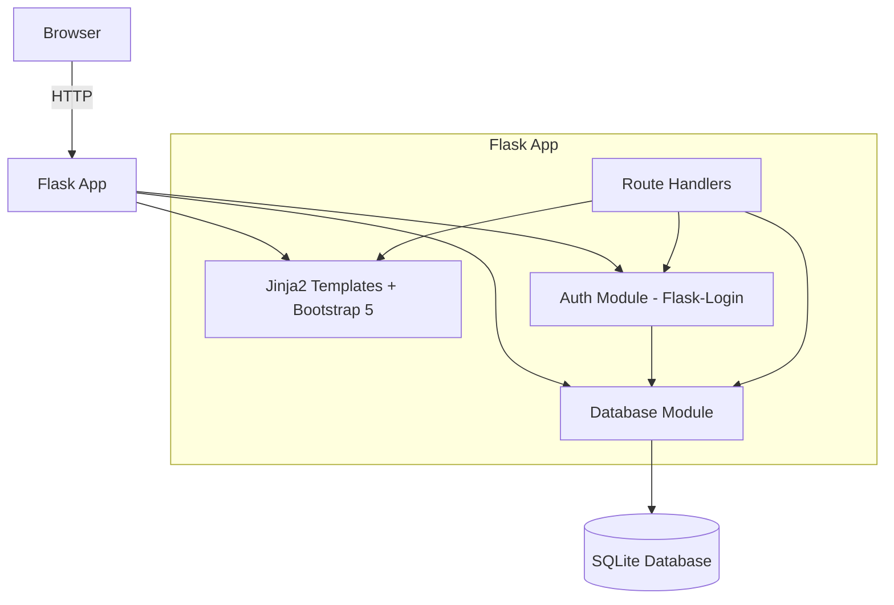
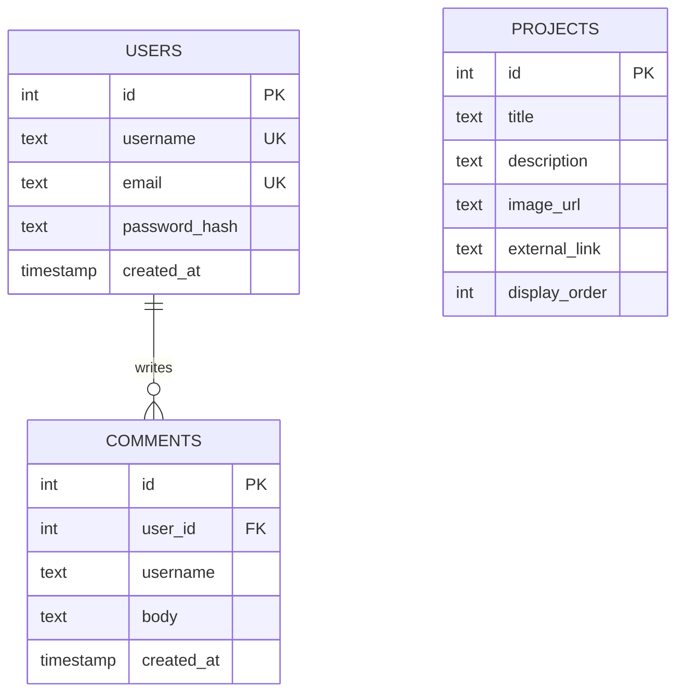

# Design Document: Personal Portfolio Site

## Overview

A single-page personal portfolio website built with Flask (Python), Bootstrap 5, and SQLite. The application serves as a professional landing page showcasing the owner's background, skills, and project portfolio. Visitors can browse content freely; authenticated visitors can leave comments. The site uses server-side rendering with Jinja2 templates, Flask-Login for session management, and a local SQLite database for persistence.

Key design decisions:
- Single-page layout with anchor-based scrolling (no SPA framework needed)
- Server-side rendering with Jinja2 — keeps the stack simple and Python-only
- Flask-Login for authentication — mature, well-documented, minimal boilerplate
- Werkzeug's `generate_password_hash` / `check_password_hash` for password hashing (bcrypt-based salted hashes)
- SQLite via Python's built-in `sqlite3` module — no ORM overhead for a small schema
- Bootstrap 5 CDN for responsive layout — no build step required
- WTForms with Flask-WTF for form handling and CSRF protection

## Architecture



The application follows a simple layered architecture:

1. **Routes Layer** (`routes.py`): Flask route handlers for page rendering, authentication endpoints, and comment submission.
2. **Auth Module** (`auth.py`): Registration, login, logout logic using Flask-Login. Password hashing via Werkzeug.
3. **Database Module** (`db.py`): All SQLite operations — schema initialization, parameterized queries, CRUD for users/projects/comments.
4. **Templates** (`templates/`): Jinja2 templates extending a base layout with Bootstrap 5 components.
5. **Static Assets** (`static/`): CSS overrides, project images.

### Project Structure

```
portfolio/
├── app.py              # Flask app factory, configuration
├── routes.py           # Route handlers
├── auth.py             # Authentication logic
├── db.py               # Database access layer
├── models.py           # Data classes for User, Project, Comment
├── forms.py            # WTForms form definitions
├── templates/
│   ├── base.html       # Base layout with navbar, footer, Bootstrap CDN
│   ├── index.html      # Main single-page template (professional, portfolio, comments sections)
│   ├── login.html      # Login form page
│   └── register.html   # Registration form page
├── static/
│   ├── css/
│   │   └── style.css   # Custom styles
│   └── images/         # Project images
├── portfolio.db        # SQLite database (created at runtime)
└── requirements.txt    # Python dependencies
```

## Components and Interfaces

### 1. Flask App Factory (`app.py`)

Responsible for creating and configuring the Flask application instance.

```python
def create_app(config=None) -> Flask:
    """Create and configure the Flask application."""
    # - Set SECRET_KEY for session/CSRF
    # - Set DATABASE_PATH (default: portfolio.db)
    # - Initialize Flask-Login
    # - Register blueprints / route handlers
    # - Initialize database on first request
```

### 2. Database Module (`db.py`)

Encapsulates all SQLite interactions. Every query uses parameterized statements to prevent SQL injection (Requirement 8.2).

```python
def get_db() -> sqlite3.Connection:
    """Return a database connection for the current request context."""

def init_db(app: Flask) -> None:
    """Create tables if they don't exist (Requirement 8.1, 8.3)."""

def get_all_projects() -> list[dict]:
    """Fetch all Project_Entry records."""

def get_all_comments() -> list[dict]:
    """Fetch all comments ordered newest-first (Requirement 5.1)."""

def create_comment(username: str, body: str) -> dict:
    """Insert a comment and return the created record."""

def create_user(username: str, email: str, password_hash: str) -> int:
    """Insert a new user, return user ID. Raises IntegrityError on duplicate."""

def get_user_by_username(username: str) -> dict | None:
    """Fetch a user record by username."""

def get_user_by_id(user_id: int) -> dict | None:
    """Fetch a user record by ID (for Flask-Login user_loader)."""
```

### 3. Auth Module (`auth.py`)

Handles registration, login, logout using Flask-Login and Werkzeug password hashing.

```python
class User(UserMixin):
    """Flask-Login compatible user class wrapping a DB user record."""
    id: int
    username: str
    email: str

def register_user(username: str, email: str, password: str) -> tuple[User | None, str | None]:
    """Validate input, hash password, create user. Returns (user, error_message)."""

def authenticate_user(username: str, password: str) -> tuple[User | None, str | None]:
    """Check credentials. Returns (user, error_message)."""
```

### 4. Forms (`forms.py`)

WTForms definitions with Flask-WTF CSRF protection.

```python
class RegistrationForm(FlaskForm):
    username: StringField  # Required
    email: StringField     # Required, email validation
    password: PasswordField  # Required, min length 8

class LoginForm(FlaskForm):
    username: StringField
    password: PasswordField

class CommentForm(FlaskForm):
    body: TextAreaField  # Required, non-empty
```

### 5. Route Handlers (`routes.py`)

```python
@app.route("/")
def index():
    """Render the main single-page view with professional info, portfolio, and comments."""

@app.route("/register", methods=["GET", "POST"])
def register():
    """Handle user registration (Requirement 3)."""

@app.route("/login", methods=["GET", "POST"])
def login():
    """Handle user login (Requirement 4)."""

@app.route("/logout")
@login_required
def logout():
    """Handle user logout (Requirement 4.4)."""

@app.route("/comment", methods=["POST"])
@login_required
def add_comment():
    """Handle comment submission (Requirement 6)."""
```

### 6. Templates

- **`base.html`**: Bootstrap 5 CDN links, navbar with section anchors (Professional, Portfolio, Comments), login/register or username/logout controls, footer with copyright.
- **`index.html`**: Extends base. Three sections with `id` anchors: `#professional`, `#portfolio`, `#comments`. Portfolio uses Bootstrap card grid. Comment section conditionally shows form (authenticated) or login prompt.
- **`login.html`** / **`register.html`**: Standalone form pages extending base.

## Data Models

### SQLite Schema

```sql
CREATE TABLE IF NOT EXISTS users (
    id INTEGER PRIMARY KEY AUTOINCREMENT,
    username TEXT NOT NULL UNIQUE,
    email TEXT NOT NULL UNIQUE,
    password_hash TEXT NOT NULL,
    created_at TIMESTAMP DEFAULT CURRENT_TIMESTAMP
);

CREATE TABLE IF NOT EXISTS projects (
    id INTEGER PRIMARY KEY AUTOINCREMENT,
    title TEXT NOT NULL,
    description TEXT NOT NULL,
    image_url TEXT,
    external_link TEXT,
    display_order INTEGER DEFAULT 0
);

CREATE TABLE IF NOT EXISTS comments (
    id INTEGER PRIMARY KEY AUTOINCREMENT,
    user_id INTEGER NOT NULL,
    username TEXT NOT NULL,
    body TEXT NOT NULL,
    created_at TIMESTAMP DEFAULT CURRENT_TIMESTAMP,
    FOREIGN KEY (user_id) REFERENCES users(id)
);
```

### Python Data Classes (`models.py`)

```python
@dataclass
class User:
    id: int
    username: str
    email: str
    password_hash: str
    created_at: str

@dataclass
class Project:
    id: int
    title: str
    description: str
    image_url: str | None
    external_link: str | None
    display_order: int

@dataclass
class Comment:
    id: int
    user_id: int
    username: str
    body: str
    created_at: str
```

### Entity Relationship Diagram



## Correctness Properties

*A property is a characteristic or behavior that should hold true across all valid executions of a system — essentially, a formal statement about what the system should do. Properties serve as the bridge between human-readable specifications and machine-verifiable correctness guarantees.*

### Property 1: Project rendering completeness

*For any* set of Project_Entry records in the database, rendering the portfolio page SHALL produce HTML containing every project's title and description, and SHALL include an image element for each project that has a non-null image_url.

**Validates: Requirements 2.1, 2.2**

### Property 2: Registration round-trip with password hashing

*For any* valid registration input (username, email, password of length >= 8), creating a user SHALL result in a database record where the username and email match the input, and the stored password_hash is not equal to the plaintext password but verifies correctly against it using Werkzeug's `check_password_hash`.

**Validates: Requirements 3.2, 3.4**

### Property 3: Duplicate registration rejection

*For any* registered user, attempting to register again with the same username or the same email SHALL fail and return an error message, leaving the total user count unchanged.

**Validates: Requirements 3.3**

### Property 4: Short password rejection

*For any* password string of length 0 to 7, attempting to register SHALL fail with a validation error, and no user record SHALL be created in the database.

**Validates: Requirements 3.5**

### Property 5: Valid login creates authenticated session

*For any* registered user, submitting login with the correct username and password SHALL result in a successful authentication and an active session containing the user's identity.

**Validates: Requirements 4.2**

### Property 6: Invalid login rejection

*For any* username/password pair that does not match a registered user's credentials, login SHALL fail and return an error message without creating a session.

**Validates: Requirements 4.3**

### Property 7: Comment ordering and display

*For any* set of comments with distinct timestamps in the database, rendering the comment section SHALL display them in descending chronological order, and each rendered comment SHALL contain the author's username and submission date.

**Validates: Requirements 5.1, 5.2**

### Property 8: Comment storage round-trip

*For any* non-empty comment string submitted by an authenticated user, the system SHALL store a record in the database where the body matches the submitted text, the username matches the authenticated user, and the created_at timestamp is set.

**Validates: Requirements 6.3**

### Property 9: Empty comment rejection

*For any* string composed entirely of whitespace (including the empty string), submitting it as a comment SHALL be rejected with a validation error, and no comment record SHALL be created in the database.

**Validates: Requirements 6.4**

### Property 10: SQL injection safety

*For any* user-supplied string containing SQL metacharacters (quotes, semicolons, comment markers, UNION/DROP keywords), using it as input to registration, login, or comment submission SHALL not alter the database schema or return unauthorized data — the input SHALL be treated as literal data.

**Validates: Requirements 8.2**

## Error Handling

### Registration Errors
- **Duplicate username/email**: Return the registration form with a flash message indicating which field conflicts. HTTP 200 (re-render form).
- **Password too short**: Return the registration form with a validation error on the password field. HTTP 200.
- **Missing required fields**: WTForms validation catches this client-side and server-side. Re-render form with field-level errors.

### Login Errors
- **Invalid credentials**: Flash a generic "Invalid username or password" message. Do not reveal whether the username exists. HTTP 200 (re-render form).
- **Missing fields**: WTForms validation. Re-render form.

### Comment Errors
- **Empty comment**: Flash a validation error. Redirect back to the main page with the comment section anchor. No DB write.
- **Database unavailable**: Catch `sqlite3.OperationalError`, flash "Could not save your comment. Please try again later." Redirect back. Log the error server-side.
- **Unauthenticated submission**: Flask-Login's `@login_required` returns 401 or redirects to login page.

### Database Errors
- **Schema initialization failure**: Log the error and raise, preventing the app from starting in a broken state.
- **Connection errors during requests**: Catch at the route level, return a user-friendly error page (HTTP 500).

### General
- Custom 404 and 500 error pages using Flask's `errorhandler` decorators.
- All user-facing error messages are generic (no stack traces or internal details exposed).

## Testing Strategy

### Testing Framework
- **pytest** for test execution
- **Hypothesis** for property-based testing (Python PBT library)
- **Flask test client** for HTTP-level integration tests
- Minimum **100 iterations** per property-based test

### Unit Tests (Example-Based)
Focus on specific scenarios and edge cases:
- Registration form renders with correct fields (Req 3.1)
- Login form renders with correct fields (Req 4.1)
- Logout terminates session and redirects (Req 4.4)
- Navbar contains section anchor links (Req 7.1, 7.2)
- Footer contains copyright text (Req 7.3)
- Comment form visible when authenticated (Req 6.1)
- Login prompt visible when not authenticated (Req 6.2)
- New comment appears after submission via redirect (Req 5.3)
- External project links render with `target="_blank"` (Req 2.3)
- DB schema created on first run (Req 8.1, 8.3)
- DB unavailable error handling for comments (Req 6.5)

### Property-Based Tests (Hypothesis)
Each property test maps to a Correctness Property above. Configuration:
- Minimum 100 examples per test via `@settings(max_examples=100)`
- Each test tagged with a comment: `# Feature: personal-portfolio-site, Property N: <title>`

| Property | Test Description | Key Generators |
|----------|-----------------|----------------|
| 1 | Project rendering completeness | Random lists of Project dicts with varying titles, descriptions, image_urls |
| 2 | Registration round-trip with hashing | Random usernames (alphanumeric), emails, passwords (len >= 8) |
| 3 | Duplicate registration rejection | Random valid user data, register twice |
| 4 | Short password rejection | Random strings of length 0-7 |
| 5 | Valid login creates session | Random registered users, login with correct creds |
| 6 | Invalid login rejection | Random non-matching credential pairs |
| 7 | Comment ordering and display | Random lists of comments with distinct timestamps |
| 8 | Comment storage round-trip | Random non-whitespace strings as comment bodies |
| 9 | Empty comment rejection | Random whitespace-only strings (spaces, tabs, newlines) |
| 10 | SQL injection safety | Random strings with SQL metacharacters mixed in |

### Integration Tests
- Full registration → login → comment → logout flow using Flask test client
- Database persistence across simulated server restarts (close and reopen app)
- Bootstrap class presence in rendered HTML for responsive layout checks
