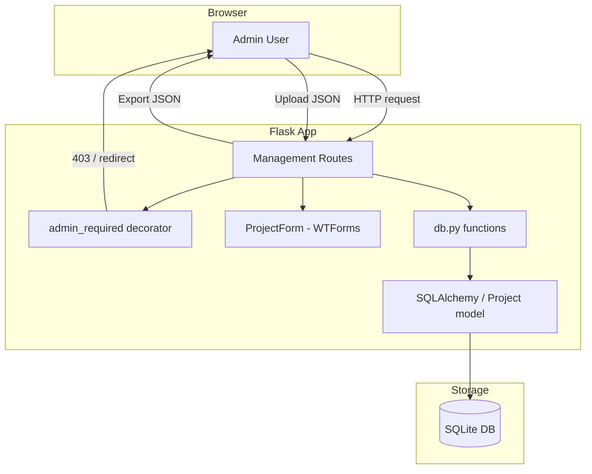

# Design Document: Portfolio Entry Management

## Overview

This feature adds admin-only CRUD operations for portfolio entries (projects), plus JSON export/import for backup and restore. The design builds on the existing Flask app factory pattern, db.py data-access layer, and Flask-Login authentication. A new `admin_required` decorator centralizes authorization checks, and new routes are registered alongside existing ones in `routes.py`.

### Key Design Decisions

1. **Admin check via decorator** — A reusable `admin_required` decorator wraps `login_required` and compares `current_user.email` against `app.config['ADMIN_EMAIL']`. This keeps authorization DRY across all management routes.
2. **Separate Blueprint vs. inline routes** — We register admin routes directly in `register_routes(app)` (consistent with the existing pattern) rather than introducing a Blueprint, to minimize structural changes.
3. **db.py returns dicts** — New functions (`get_project_by_id`, `create_project`, `update_project`, `delete_project`) follow the established convention of returning plain dicts.
4. **JSON export excludes `id`** — Exported records omit the database primary key so imports create fresh rows without ID conflicts.
5. **Import is all-or-nothing** — If any entry in the uploaded JSON fails validation, no records are created (transactional safety).

## Architecture



### Request Flow

1. Browser sends request to a management route (e.g., `/admin/projects/create`).
2. `admin_required` decorator checks authentication (redirects to login if not) and admin status (returns 403 if not admin).
3. Route handler processes the request using `ProjectForm` for validation and `db.py` functions for persistence.
4. Response is rendered (template or redirect with flash message).

## Components and Interfaces

### 1. Admin Authorization Decorator (`portfolio/auth.py`)

```python
from functools import wraps
from flask import abort, current_app
from flask_login import current_user, login_required

def admin_required(f):
    """Decorator that requires the user to be authenticated AND be the admin."""
    @wraps(f)
    @login_required
    def decorated_function(*args, **kwargs):
        admin_email = current_app.config.get('ADMIN_EMAIL')
        if not admin_email or current_user.email != admin_email:
            abort(403)
        return f(*args, **kwargs)
    return decorated_function
```

### 2. ProjectForm (`portfolio/forms.py`)

```python
class ProjectForm(FlaskForm):
    title = StringField("Title", validators=[DataRequired()])
    description = TextAreaField("Description", validators=[DataRequired()])
    image_url = StringField("Image URL", validators=[Optional(), URL()])
    external_link = StringField("External Link", validators=[Optional(), URL()])
    display_order = IntegerField("Display Order", default=0, validators=[Optional()])
```

### 3. Database Functions (`portfolio/db.py`)

| Function | Signature | Returns |
|----------|-----------|---------|
| `get_project_by_id` | `(project_id: int) -> dict \| None` | Project dict or None |
| `create_project` | `(title, description, image_url=None, external_link=None, display_order=0) -> dict` | Created project dict |
| `update_project` | `(project_id, title, description, image_url=None, external_link=None, display_order=0) -> dict \| None` | Updated project dict or None |
| `delete_project` | `(project_id: int) -> bool` | True if deleted, False if not found |

### 4. Route Handlers (`portfolio/routes.py`)

| Route | Method | Handler | Description |
|-------|--------|---------|-------------|
| `/admin/projects` | GET | `admin_projects` | List all projects in management table |
| `/admin/projects/create` | GET, POST | `admin_create_project` | Show form / create project |
| `/admin/projects/<int:id>/edit` | GET, POST | `admin_edit_project` | Show pre-filled form / update project |
| `/admin/projects/<int:id>/delete` | POST | `admin_delete_project` | Delete project |
| `/admin/projects/export` | GET | `admin_export_projects` | Download JSON file |
| `/admin/projects/import` | GET, POST | `admin_import_projects` | Show upload form / process JSON |

All routes are decorated with `@admin_required`.

### 5. Templates

| Template | Purpose |
|----------|---------|
| `admin_projects.html` | Management list table with action links |
| `admin_project_form.html` | Shared create/edit form |
| `admin_import.html` | File upload form for JSON import |

All extend `base.html`.

### 6. Navigation Bar Update (`base.html`)

Conditionally render admin links when the current user is the admin:

```html

<li class="nav-item">
    <a class="nav-link" href="{{ url_for('admin_projects') }}">Manage Portfolio</a>
</li>

```

## Data Models

### Existing Project Model (no changes needed)

```python
class Project(db.Model):
    __tablename__ = "projects"
    id = db.Column(db.Integer, primary_key=True, autoincrement=True)
    title = db.Column(db.String, nullable=False)
    description = db.Column(db.String, nullable=False)
    image_url = db.Column(db.String, nullable=True)
    external_link = db.Column(db.String, nullable=True)
    display_order = db.Column(db.Integer, default=0)
```

### JSON Export/Import Schema

```json
[
  {
    "title": "Project Title",
    "description": "Project description text",
    "image_url": "https://example.com/image.png",
    "external_link": "https://example.com",
    "display_order": 1
  }
]
```

**Validation rules for import:**
- Must be a JSON array
- Each entry must have `title` (non-empty string) and `description` (non-empty string)
- `image_url`, `external_link`: optional strings (default `None`)
- `display_order`: optional integer (default `0`)

### App Configuration Addition

```python
app.config["ADMIN_EMAIL"] = os.environ.get("ADMIN_EMAIL", "")
```


## Correctness Properties

*A property is a characteristic or behavior that should hold true across all valid executions of a system — essentially, a formal statement about what the system should do. Properties serve as the bridge between human-readable specifications and machine-verifiable correctness guarantees.*

### Property 1: Admin authorization gate

*For any* HTTP request to any admin-protected route, access SHALL be granted if and only if the requester is authenticated and their email matches the configured `ADMIN_EMAIL`. Unauthenticated requests are redirected to login; authenticated non-admin requests receive 403.

**Validates: Requirements 1.4, 2.4, 3.3, 4.3, 5.4, 6.5, 8.2, 8.3, 8.4**

### Property 2: Create project preserves data

*For any* valid project data (non-empty title, non-empty description, optional image_url, optional external_link, integer display_order), calling `create_project` SHALL return a dict whose field values are equal to the inputs provided.

**Validates: Requirements 1.1**

### Property 3: Update project preserves data

*For any* existing project and any valid updated field values, calling `update_project` SHALL return a dict whose field values are equal to the new inputs provided.

**Validates: Requirements 2.1**

### Property 4: Delete project removes record

*For any* existing project, calling `delete_project` SHALL cause `get_project_by_id` for that project's ID to return None.

**Validates: Requirements 3.1**

### Property 5: Project listing is ordered by display_order

*For any* set of projects in the database, `get_all_projects()` SHALL return them in non-decreasing order of `display_order`.

**Validates: Requirements 4.1**

### Property 6: Export produces correct field set

*For any* project in the database, the exported JSON object SHALL contain exactly the keys `title`, `description`, `image_url`, `external_link`, and `display_order` — and SHALL NOT contain `id` or any other key.

**Validates: Requirements 5.2, 5.3**

### Property 7: Import rejects invalid entries without side effects

*For any* JSON array where at least one entry is missing a required field (title or description), the import operation SHALL create zero project records and return an error.

**Validates: Requirements 6.3**

### Property 8: JSON export/import round-trip

*For any* set of valid project records, exporting them via the export function and then importing the resulting JSON SHALL produce project records with field values equivalent to the originals (title, description, image_url, external_link, display_order).

**Validates: Requirements 7.1, 7.2**

## Error Handling

| Scenario | Behavior |
|----------|----------|
| Unauthenticated access to admin route | Redirect to `/login` (Flask-Login default) |
| Authenticated non-admin access | Return 403 Forbidden (abort) |
| Edit/delete non-existent project | Return 404 Not Found |
| Form validation failure (create/edit) | Re-render form with field-specific errors |
| Import: file is not valid JSON | Flash error "Invalid JSON file", redirect to import page |
| Import: entry missing required fields | Flash error identifying invalid entries, no records created |
| Import: no file uploaded | Flash error "No file selected", redirect to import page |
| Database error during write | Flash generic error, redirect back (existing pattern) |

### Flash Message Categories

- `"success"` — successful create, update, delete, import operations
- `"error"` — validation failures, authorization issues, file format errors

## Testing Strategy

### Unit Tests (example-based)

- Form validation: verify `ProjectForm` rejects empty title/description, accepts valid data
- Route protection: verify unauthenticated → redirect, non-admin → 403, admin → 200
- Edit non-existent project → 404
- Delete non-existent project → 404
- Delete via GET → 405 or method not allowed
- Import invalid JSON → error message
- Nav bar shows/hides admin links based on user role
- Export Content-Disposition header is set to attachment

### Property-Based Tests (using Hypothesis)

The project will use the **Hypothesis** library for property-based testing in Python.

Each property test MUST:
- Run a minimum of 100 iterations
- Reference its design document property via a tag comment
- Use `@given` decorators with appropriate strategies for generating test data

**Property test configuration:**
- Library: `hypothesis` (Python)
- Minimum iterations: 100 (Hypothesis default is 100 examples)
- Tag format: `# Feature: portfolio-entry-management, Property {number}: {property_text}`

**Properties to implement:**

1. **Property 1** — Admin authorization gate: Generate random user emails, test against admin routes, verify access control.
2. **Property 2** — Create project preserves data: Generate random valid project fields, create, verify returned dict matches.
3. **Property 3** — Update project preserves data: Generate random valid updates, apply to existing project, verify returned dict matches.
4. **Property 4** — Delete project removes record: Create random project, delete, verify gone.
5. **Property 5** — Project listing ordered: Create multiple projects with random display_order, verify list is sorted.
6. **Property 6** — Export correct field set: Create random projects, export, verify JSON keys.
7. **Property 7** — Import rejects invalid entries: Generate arrays with at least one invalid entry, verify zero records created.
8. **Property 8** — JSON round-trip: Create random projects, export, import, verify equivalence.

### Integration Tests

- Full request cycle: login as admin → create project → verify on index page
- Export → import → verify data integrity end-to-end via HTTP
- CSRF token handling in forms
