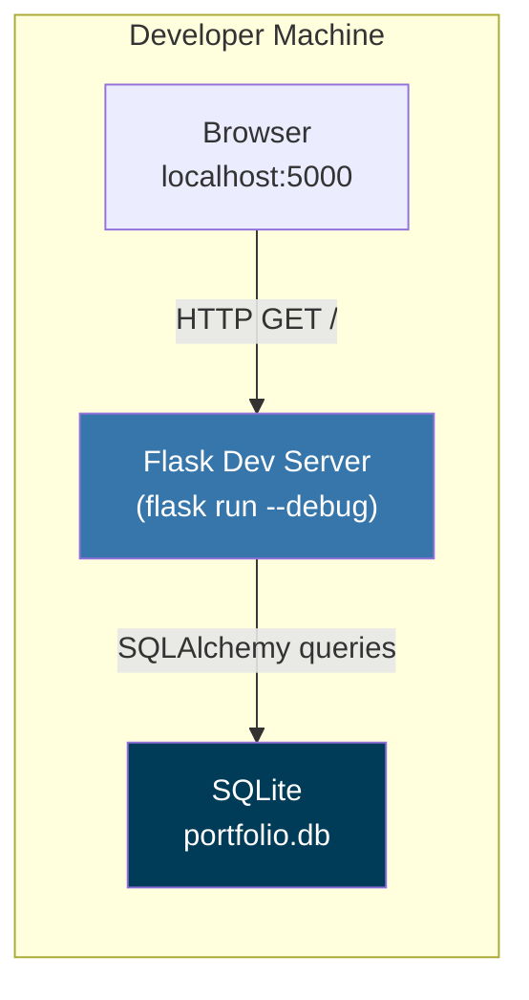
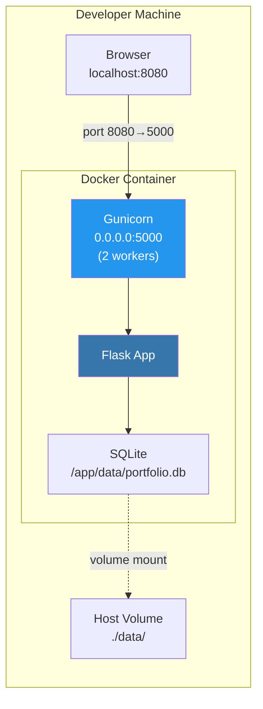
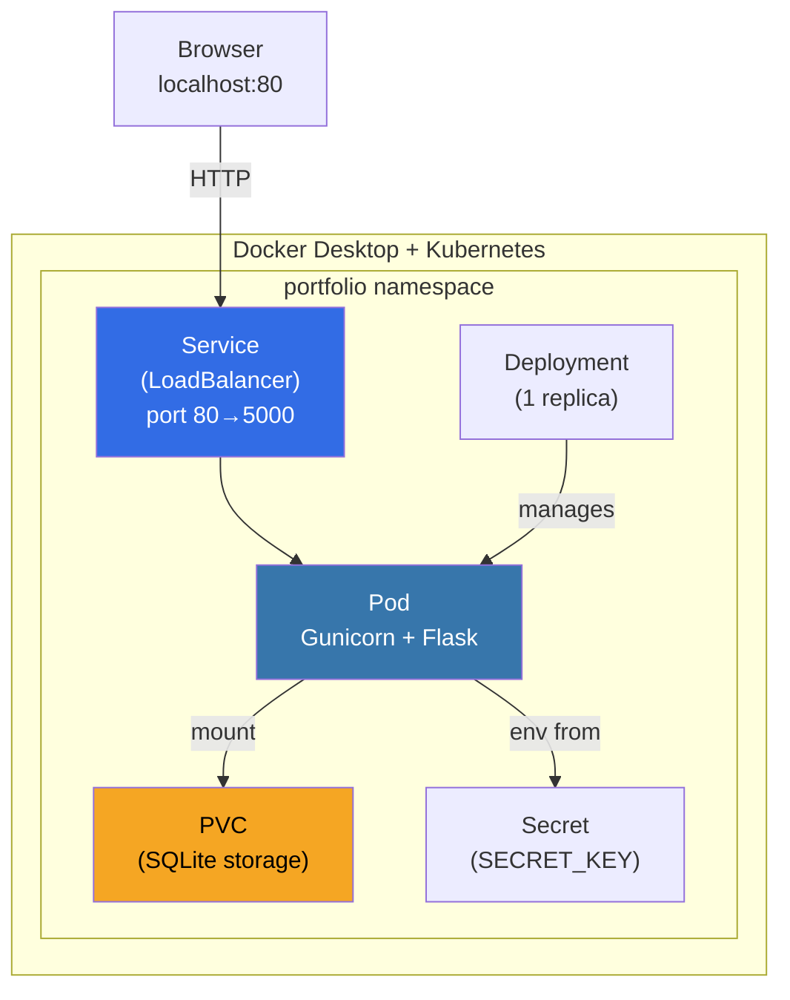
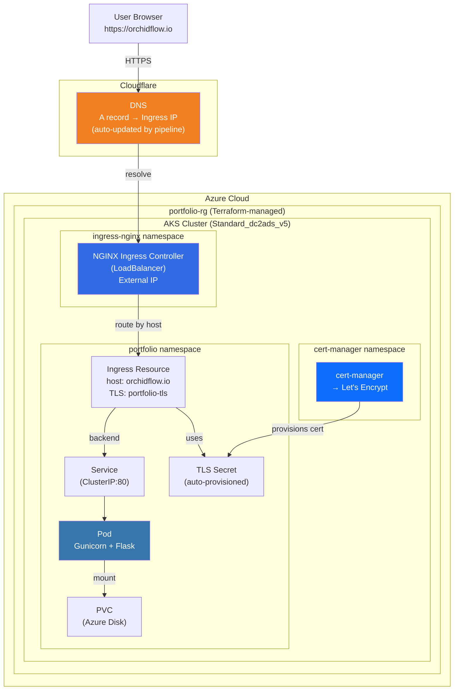
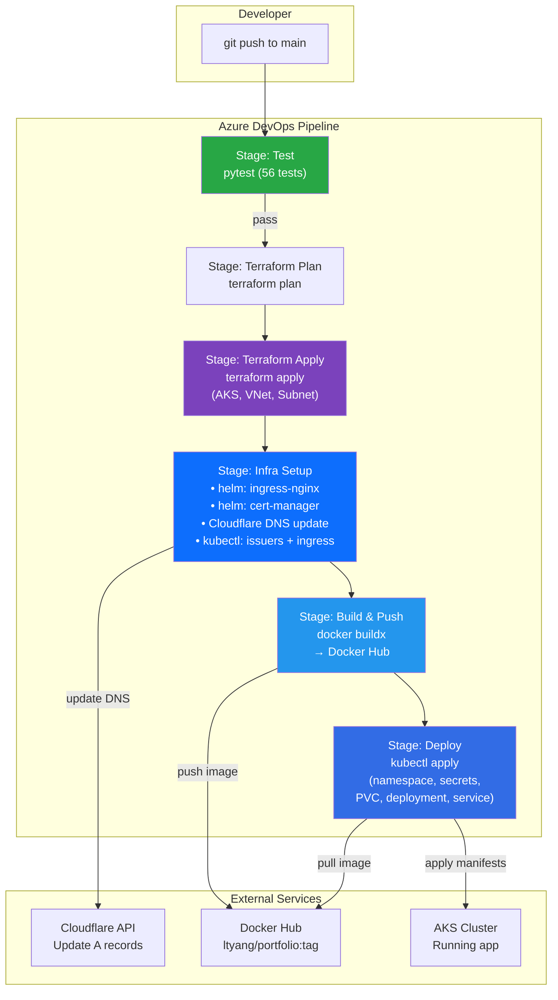
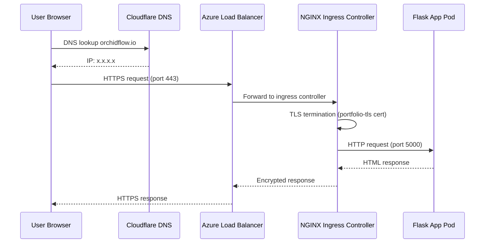
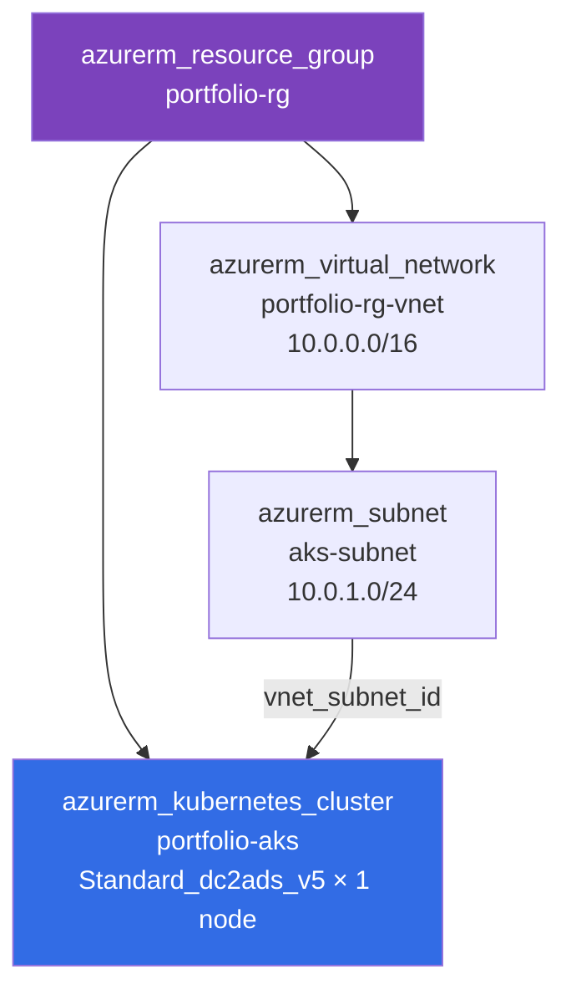

# AI-Powered App Development Journey with Kiro

A summary of building and deploying a personal portfolio site from scratch using Kiro as an AI development partner.

---

## The App

**Personal Portfolio Site** — A full-stack web application showcasing professional information, project portfolio, and a visitor comment system.

- **Live URL:** https://orchidflow.io https://ltyang.pythonanywhere.com/
- **Stack:** Python/Flask, SQLAlchemy, Bootstrap 5, Docker, Kubernetes, Terraform
- **Development Tool:** Kiro (AI-powered IDE)

---

## Development Phases

### Phase 1: Application Development

- Built a Flask web app using the app factory pattern
- Implemented user authentication (registration, login, Flask-Login)
- Created SQLAlchemy models (User, Project, Comment)
- Designed a single-page layout with Bootstrap 5
- Added admin panel for portfolio entry management (CRUD + JSON import/export)
- Used property-based testing (Hypothesis) for correctness validation

### Phase 2: Containerization

- Created a Dockerfile with Gunicorn for production serving
- Set up docker-compose for local container development
- Configured volume mounts for SQLite persistence

### Phase 3: Kubernetes Deployment

- Wrote K8s manifests (Deployment, Service, PVC, Secrets, Namespace)
- Created a local deployment script for Docker Desktop K8s
- Configured resource limits, health probes, and readiness checks

### Phase 4: Infrastructure as Code (Terraform)

- Defined AKS cluster, VNet, and subnet in Terraform
- Configured remote state storage in Azure Blob Storage
- Parameterized all infrastructure with variables

### Phase 5: CI/CD Pipeline (Azure Pipelines)

- Built a multi-stage pipeline: Test → Terraform → Infra Setup → Build → Deploy
- Automated Docker image builds with buildx (linux/amd64)
- Integrated pytest as a gate before deployment

### Phase 6: HTTPS & DNS Automation

- Installed NGINX Ingress Controller via Helm
- Set up cert-manager for automatic Let's Encrypt certificates
- Integrated Cloudflare DNS API for automatic A record updates
- Achieved zero-manual-intervention deployments (even after full cluster recreation)

---

## Architecture Options (Simple → Advanced)

### Option 1: Local Python Development

```
Developer Machine
└── Python venv
    └── Flask dev server (port 5000)
        └── SQLite file
```

**Components:** Python, Flask, SQLite
**Use case:** Active development, debugging, hot-reload
**Complexity:** Minimal

---

### Option 2: Docker Compose

```
Developer Machine
└── Docker Desktop
    └── Container: Gunicorn + Flask (port 8080→5000)
        └── Volume mount: ./data/portfolio.db
```

**Components:** Docker, Gunicorn, Flask, SQLite
**Use case:** Testing containerized behavior locally
**Complexity:** Low

---

### Option 3: Local Kubernetes (Docker Desktop)

```
Developer Machine
└── Docker Desktop + K8s
    └── Namespace: portfolio
        ├── Deployment (1 pod: Gunicorn + Flask)
        ├── Service (LoadBalancer, port 80→5000)
        ├── PVC (SQLite persistence)
        └── Secret (app config)
```

**Components:** Docker, Kubernetes, kubectl, Gunicorn, Flask, SQLite
**Use case:** Testing K8s manifests before cloud deployment
**Complexity:** Medium

---

### Option 4: Production (AKS + Full Automation)

```
Internet
│
├── Cloudflare DNS (orchidflow.io → Ingress IP)
│
└── Azure Cloud
    └── AKS Cluster (Terraform-managed, 1 node Standard_dc2ads_v5)
        ├── ingress-nginx namespace
        │   └── NGINX Ingress Controller (LoadBalancer, external IP)
        │
        ├── cert-manager namespace
        │   └── cert-manager (Let's Encrypt auto-TLS)
        │
        └── portfolio namespace
            ├── Deployment (Flask app pod)
            ├── Service (ClusterIP → port 5000)
            ├── Ingress (TLS termination, host routing)
            ├── PVC (SQLite on Azure Disk)
            ├── Secret (app config)
            └── TLS Secret (auto-provisioned cert)
```

**Components:** Terraform, AKS (Standard_dc2ads_v5), Docker Hub, NGINX Ingress, cert-manager, Let's Encrypt, Cloudflare, Azure Pipelines, Gunicorn, Flask, SQLite
**Use case:** Production hosting with HTTPS
**Complexity:** High (but fully automated)

---

## Architecture Diagrams

Detailed Mermaid diagrams showing logical linkage, relationships, and key settings for each deployment option.

### Diagram 1: Local Python Development



**Key settings:**
- `FLASK_APP=portfolio.app`
- `flask run --debug` enables hot-reload
- Database auto-created at `./portfolio.db` or `$DATABASE_PATH`

---

### Diagram 2: Docker Compose



**Key settings:**
- `docker-compose.yml`: ports `8080:5000`
- Volume: `./data:/app/data` (data persists across restarts)
- `SECRET_KEY` and `DATABASE_PATH` set via environment variables

---

### Diagram 3: Local Kubernetes (Docker Desktop)



**Key settings:**
- `kubectl config use-context docker-desktop` (target local cluster)
- `imagePullPolicy: Never` (use locally-built image)
- Service type: `LoadBalancer` (Docker Desktop maps to localhost)
- PVC for SQLite persistence across pod restarts

---

### Diagram 4: Production (AKS + Full Automation)



**Key settings:**
- Ingress annotation: `cert-manager.io/cluster-issuer: letsencrypt-prod`
- Ingress annotation: `nginx.ingress.kubernetes.io/ssl-redirect: "true"`
- TLS hosts: `orchidflow.io`, `www.orchidflow.io`
- cert-manager solver: HTTP-01 via ingress class `nginx`
- Cloudflare DNS: `proxied: false` (DNS only, for HTTP-01 challenge)

---

### Diagram 5: CI/CD Pipeline (End-to-End)



**Key settings:**
- Pipeline trigger: `branches: include: [main]`
- Pool: `name: 'Default'` (self-hosted macOS agent)
- Image tag: `$(Build.BuildId)` (unique per build)
- Terraform state: remote backend (Azure Blob Storage)
- Secrets: pipeline variables (ARM_*, DOCKERHUB_*, CLOUDFLARE_*)

---

### Diagram 6: Request Flow (HTTPS)



**Key settings:**
- Flask `ProxyFix` middleware trusts `X-Forwarded-Proto` header
- `url_for()` generates `https://` URLs correctly behind proxy
- cert-manager auto-renews certificate before expiry

---

### Diagram 7: Terraform Resource Relationships



**Key settings:**
- `kubernetes_version`: 1.34
- `network_plugin`: kubenet
- `load_balancer_sku`: standard
- `service_cidr`: 172.16.0.0/16
- State stored in Azure Blob Storage (separate resource group)

---

## CI/CD Pipeline Flow

```
Push to main
    │
    ▼
┌─────────────────┐
│   Stage: Test   │  pytest (unit + property-based)
└────────┬────────┘
         │ pass
         ▼
┌─────────────────────┐
│ Stage: Terraform    │  Plan → Apply (AKS, VNet)
└────────┬────────────┘
         │
         ▼
┌─────────────────────────┐
│ Stage: Infra Setup      │  Helm: ingress-nginx + cert-manager
│                         │  Cloudflare: update DNS A records
└────────┬────────────────┘
         │
         ▼
┌─────────────────────┐
│ Stage: Build & Push │  Docker buildx → Docker Hub
└────────┬────────────┘
         │
         ▼
┌─────────────────────┐
│ Stage: Deploy       │  kubectl apply manifests to AKS
└─────────────────────┘
```

---

## Key Learnings & Decisions

### Testing Strategy
- **Unit tests** for database operations and authentication
- **Property-based tests** (Hypothesis) for admin auth, project CRUD, export/import
- Tests run as a pipeline gate — broken code never reaches production

### Infrastructure Decisions
- **Dynamic IP + Cloudflare DNS** over static IP — saves ~$3.65/month, zero manual DNS updates
- **cert-manager** over manual TLS — certificates auto-renew, no expiry risk
- **Terraform** for infrastructure — reproducible, version-controlled, destroyable
- **Self-hosted Azure DevOps agent** — runs on local Mac, avoids Microsoft-hosted agent costs

### Cost Management
- `az aks stop` / `az aks start` for pausing the cluster (no compute charges when stopped)
- `terraform destroy` for full teardown (pipeline recreates everything on next push)
- Cloudflare free tier for DNS (no monthly cost)
- Docker Hub free tier for image storage

### Challenges Solved
- AKS `admissionsenforcer` conflicting with cert-manager webhook (delete webhook before install)
- Hostinger CDN blocking A record creation (migrated DNS to Cloudflare)
- Pipeline service principal lacking role assignment permissions (manual one-time grant)
- WTForms URL validator rejecting relative paths for local images (custom validator)

---

## Tools & Services Used

| Category | Tool/Service | Purpose |
|----------|-------------|---------|
| IDE | Kiro | AI-powered development partner |
| Language | Python 3.14 | Application code |
| Framework | Flask 3.x | Web framework |
| ORM | SQLAlchemy | Database access |
| Frontend | Bootstrap 5 | Responsive UI |
| Testing | pytest + Hypothesis | Unit + property-based tests |
| Container | Docker | Application packaging |
| Orchestration | Kubernetes (AKS) | Container orchestration |
| IaC | Terraform | Infrastructure provisioning |
| CI/CD | Azure Pipelines | Automated build/deploy |
| Ingress | NGINX Ingress Controller | HTTP/HTTPS routing |
| TLS | cert-manager + Let's Encrypt | Automatic HTTPS certificates |
| DNS | Cloudflare | DNS management + API |
| Registry | Docker Hub | Container image storage |
| Domain | orchidflow.io | Production domain |
| Hosting (alt) | PythonAnywhere | Demo/showcase alternative |

---

## What Kiro Helped With

- **Spec-driven development** — Requirements → Design → Tasks workflow
- **Code generation** — Flask app, models, routes, forms, templates
- **Testing** — Property-based test design and implementation
- **Infrastructure** — Dockerfile, K8s manifests, Terraform configs
- **CI/CD** — Azure Pipelines YAML with multi-stage automation
- **Debugging** — Pipeline errors, DNS issues, Helm conflicts, permission problems
- **Architecture decisions** — Static vs dynamic IP, Cloudflare vs Hostinger, cost optimization
- **Documentation** — README, steering files, this presentation document


---

## Working Effectively with AI: Dos and Don'ts

Lessons learned from building this project end-to-end with Kiro as an AI development partner.

### Do: Ask "Why" Before "How"

Understanding the reasoning behind a solution leads to better decisions. When Kiro suggested a static IP for DNS stability, asking "what's the cost?" and "is there an alternative?" led to discovering the Cloudflare approach — which was free and fully automated.

**Example from our interaction:**
> "What would be the impact for using static IP from Terraform for Ingress external IP setup?"
> → This question uncovered the $3.65/month cost and the role assignment complexity, leading to the simpler Cloudflare solution.

### Do: Provide Context About Constraints

AI can't read your mind about budget, existing infrastructure, or preferences. Sharing constraints early saves iteration cycles.

**Example:**
> "There is another resource group for keeping terraform state. In most of the time, I don't need to keep this app running."
> → This context shifted the recommendation from "keep a static IP running 24/7" to "use dynamic IP with automated DNS updates."

### Do: Share Error Messages Verbatim

Copy-paste the full error output. AI can diagnose issues much faster with exact error messages than with paraphrased descriptions.

**Example:**
> Pasting the full `admissionsenforcer` conflict error from the pipeline log → led to a targeted fix (delete the conflicting webhook before install) rather than generic troubleshooting.

### Do: Challenge Recommendations

AI suggestions aren't always optimal for your specific situation. Push back when something doesn't feel right.

**Example:**
> "I prefer to retain the PythonAnywhere section for possible demo and showcase in parallel."
> → The AI had removed it during a refactor, but the user's use case justified keeping it.

### Do: Think in Increments

Break complex goals into smaller questions. Each answer builds context for the next.

**Example flow:**
1. "What does it take to support HTTPS?" → Got overview of all options
2. "Please help to setup AKS Ingress + cert-manager" → Got implementation
3. "I got my domain, please update ingress.yaml" → Got domain-specific config
4. "Is it possible to automatically update DNS?" → Discovered Cloudflare approach

### Don't: Accept the First Solution Without Understanding Trade-offs

The first answer is often correct but may not be optimal for your constraints.

**Example:**
> Kiro initially suggested a static IP in Terraform. After discussing cost and teardown implications, the dynamic IP + Cloudflare approach emerged as better for the use case.

### Don't: Skip Verification Steps

When AI makes changes, verify them. Run tests, check builds, confirm behavior.

**Example:**
> After every code change, running `pytest` caught issues early. After pipeline changes, triggering a build immediately revealed problems (cert-manager conflicts, missing namespaces) that were fixed iteratively.

### Don't: Provide Vague Problem Descriptions

"It doesn't work" is less useful than "I got error X when running command Y."

**Good example from our interaction:**
> "When I run ./setup-ingress.sh I got an error: kubernetes cluster unreachable: Get https://portfolio-aks-dns-3i7oksbf.hcp.southeastasia.azmk8s.io:443/version: dial tcp: lookup ... no such host"
> → Immediately diagnosable as "cluster is stopped."

### Don't: Assume AI Remembers Previous Sessions

Each conversation starts fresh. Provide relevant context or reference specific files.

**Example:**
> "Why I cannot find our chat history for debugging the Azure pipeline?"
> → AI explained the limitation and offered to start fresh with current state.

### Do: Use AI for Exploration, Decide Yourself

AI is excellent at presenting options with trade-offs. The human makes the final call.

**Example:**
> AI presented: Static IP ($3.65/month, no DNS changes) vs Dynamic IP + Cloudflare (free, automated) vs Dynamic IP + Hostinger (free, manual)
> → Human chose Cloudflare based on their priorities (cost + automation).

### Do: Let AI Handle Repetitive/Mechanical Work

File updates across multiple locations, YAML generation, boilerplate code — these are where AI saves the most time.

**Example:**
> Updating the domain from `orchidpay.io` to `orchidflow.io` across ingress.yaml, Terraform variables, pipeline config, and documentation — done in one request.

---

## Summary: The Human-AI Partnership Model

```
Human Responsibilities          AI Responsibilities
─────────────────────          ─────────────────────
• Define goals & constraints   • Generate implementation options
• Make architectural decisions • Write code and configurations
• Provide domain context       • Debug errors from logs
• Verify and test results      • Handle repetitive updates
• Ask clarifying questions     • Explain trade-offs
• Own the final product        • Document decisions
```

The most productive pattern: **Human steers direction, AI handles execution.** The human brings judgment, priorities, and real-world constraints. The AI brings speed, breadth of knowledge, and tireless attention to detail.
